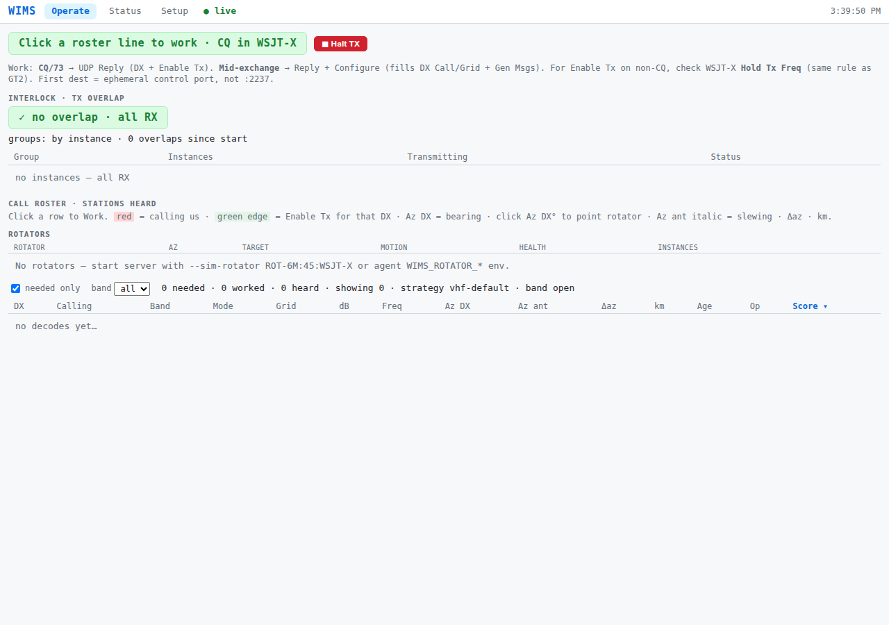
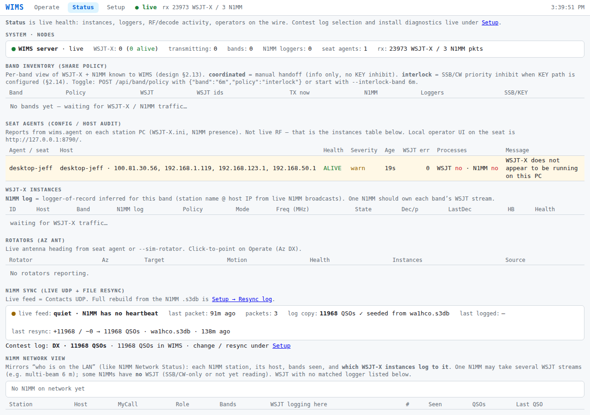
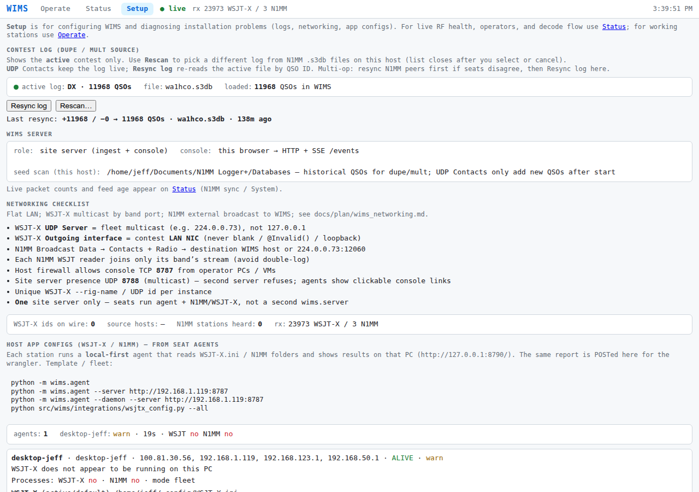
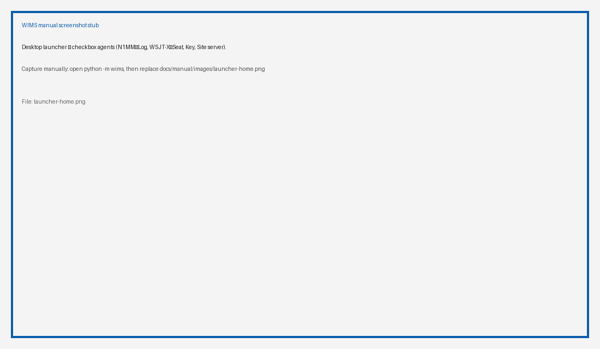
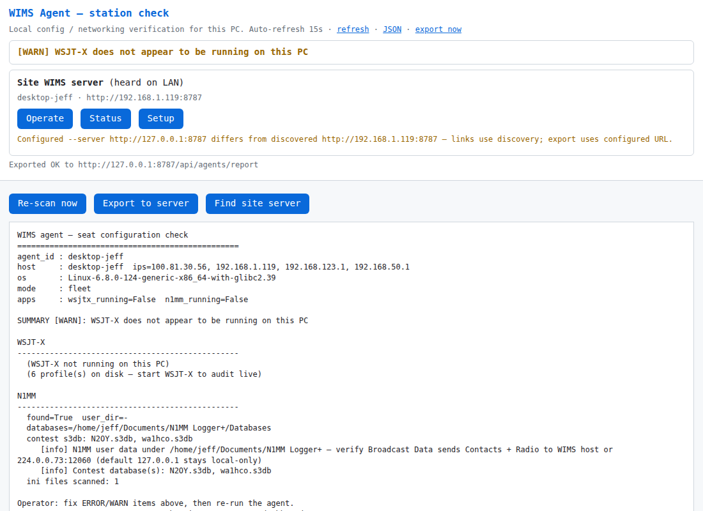
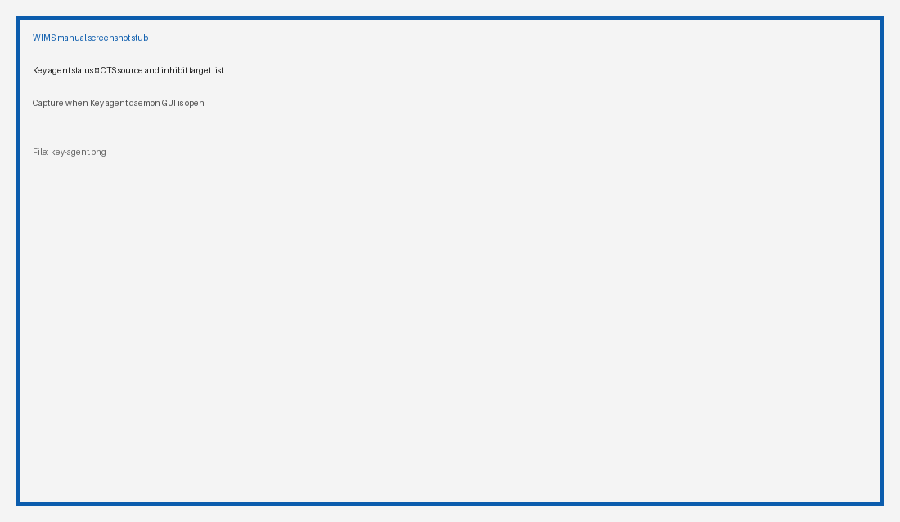
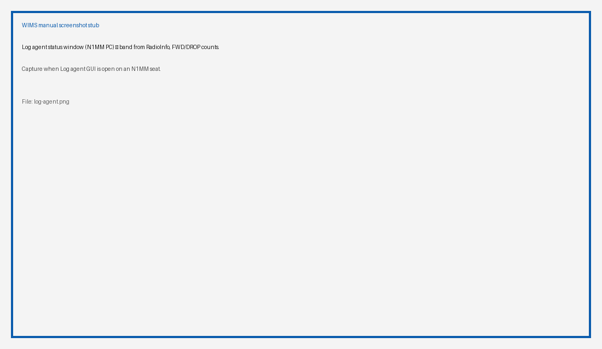

# WSJT-X Instance Management System (WIMS) — User Manual

**Audience:** contest operators and seat wranglers (W2SZ multi-multi VHF and similar).  
**Screenshots:** refresh with `scripts/capture-user-manual-shots.sh` (see [manual/README.md](manual/README.md)).  
**Related:** [tester_runbook.md](tester_runbook.md), [plan/wims_design.md](plan/wims_design.md), [plan/wims_networking.md](plan/wims_networking.md).

---

## What WIMS is for

WIMS is built for **multi-multi contesting**. The launch application is the **ARRL VHF/UHF contest**, but the same patterns apply wherever several WSJT-X instances and loggers share a LAN.

Contesting today is dominated by WSJT-X digital modes, while **SSB and CW** still matter. The usual practice is to switch between FT8 and SSB/CW rather than run both at once. That creates problems:

- Missed contacts in the mode not currently in use
- Time-consuming mode switches

At W2SZ we have learned that **FT8 can decode between SSB/CW transmissions** — call it **FT8 break-in**. The scenario: a second radio listens on the band’s FT8 frequency while the SSB/CW station calls CQ or works search-and-pounce.

### Preferred minimal FT8 break-in setup

- SSB/CW radio plus a second FT8 radio
- Receive split and routed to both radios
- Transmit paths through a selection relay
- KEY line from one radio controls the selection relay
- **WIMS keeps the two radios from transmitting at the same time**

To minimize SSB/CW workload, the FT8 radio listens continuously and reports **needed** decodes to a **call roster**. The SSB/CW operator can start WSJT-X working a station by **clicking a roster line**.

What’s new: the SSB/CW operator can keep calling CQ or answering S&P while WSJT-X works and logs a station. Interrupting the FT8 transmitter (via inhibit) is like losing pieces of a received signal — decoding at the DX end often still succeeds.

That overlap is the **inhibit** path: a beta WSJT-X can release PTT when another radio’s KEY asserts.

### WIMS functions today

1. **Call roster** — needed stations for SSB/CW or FT8 operators  
2. **Inhibit** — SSB/CW KEY → WSJT-X PTT release so both can coexist safely  
3. **Logging** — WSJT-X Logged QSOs → N1MM on the logger PC  

---

## Quick start (one PC or a seat)

```bash
# Desktop launcher (recommended)
python -m wims

# Or site server only
python -m wims server
```

- **Windows:** Desktop **WIMS** shortcut / `Start-WimsLauncher.cmd`  
- **Linux:** `scripts/install-wims-desktop.sh` (needs `python3-tk`)  
- Site console (when the site server is up): `http://<server>:8787/`  

The launcher has two panels: **Running on this PC** (live apps/agents) and
**This seat will run** (remembered intent). Check N1MM / WSJT-X / SSB-CW KEY /
Site server to start Log / Seat / Key / site-server agents.

### Install on Windows (first time)

1. Get the tree onto the PC (`git clone https://github.com/wa1hco/WIMS.git` or USB copy).  
2. Double-click **`scripts\windows\Install-Wims.cmd`** (Run as administrator once on a golden image).  
3. That installs Python + Git if needed, pulls/clones the repo, and creates Desktop **WIMS** and **Update WIMS**.  
4. Day-to-day: open Desktop **WIMS** only.  

Details: [scripts/windows/README.md](../scripts/windows/README.md).

### Update on Windows (one click)

When GitHub `main` is ahead of this PC:

- Launcher (on open, and about every 45 minutes while open): yellow banner + **Update WIMS**
- Seat agent daemon: gentle **desktop toast** once per new version (does **not** steal
  focus from N1MM/WSJT) and a note on `http://127.0.0.1:8790/`
- You still **click** Desktop **Update WIMS** to install — nothing auto-pulls mid-contact

Early `0.0.x` releases may ship bug fixes during a contest; the toast is the soft prod.

```text
scripts\windows\Update-Wims.cmd
```

---

## Site console

One **site server** per contest LAN serves Operate / Status / Setup in the browser.

### Operate (call roster)



*Site console — Operate (call roster). Click a line to Work; Halt TX always available.*

The roster works by:

- Reading/creating a copy of the N1MM contest log database  
- Updating that copy from N1MM log messages on the LAN  
- Receiving decodes from WSJT-X instances on the network  
- Testing each decode for **needed vs dupe**  

**Operator actions:** click a roster line to **Work** (Reply). **Halt TX** is always available. There is no global “arm TX” — a human always initiates work.

### Status



*Site console — Status (fleet / instances / interlock).*

Use Status for fleet health: which instances are heard, interlock/overlap, and related diagnostics.

### Setup



*Site console — Setup (log seed, resync, site options).*

Use Setup to pick/resync the N1MM `.s3db` contest log and adjust site options.

---

## Desktop launcher and agents

Open `python -m wims` on each seat PC. Agents are started from checkboxes that track what is live on that PC:

| Asset | Agent | Role |
|-------|--------|------|
| N1MM | **Log agent** | Fleet Logged QSOs → local N1MM |
| WSJT-X (N instances) | **Seat agent** | Config check + local monitor for all local WSJT-X |
| Key (CTS) | **Key agent** | KEY/CTS → inhibit targets (no companion app) |
| Site server | **Site server** | Fleet console (:8787); one per LAN |



*Desktop launcher — checkbox agents (N1MM→Log, WSJT-X→Seat, Key, Site server).*

### Seat agent (local page)

On a WSJT-X PC the Seat agent also serves a local status page:



*Seat agent local page (:8790) — config check for WSJT-X on this PC.*

Typical URL: `http://127.0.0.1:8790/`.

---

## Call roster (detail)

See [Operate](#operate-call-roster) above for the live screenshot.

Summary for operators:

1. Keep N1MM’s contest log healthy (Broadcast Data as documented for your seat).  
2. Keep WSJT-X instances on the fleet multicast band ports (see networking plan).  
3. Watch Operate for needed calls; click to Work; use Halt TX when you must stop.  

---

## Inhibit

The inhibit path:

- A small **Key agent** reads KEY/CTS from the SSB/CW radio (USB serial).  
- When KEY is asserted it sends packets to WSJT-X **inhibit** sockets so FT8 releases PTT.  
- Target list is configured (e.g. `WIMS_KEY_TARGETS=host:port,…`).  



*Key agent status — CTS source and inhibit target list.*

Product fan-out is still evolving; see [plan/wims_key_agent.md](plan/wims_key_agent.md) and [plan/wims_tx_inhibit.md](plan/wims_tx_inhibit.md).

---

## Logging

WSJT-X sends Logged QSOs on the fleet multicast. On each **N1MM PC**, the **Log agent**:

- Joins the fleet mcast  
- Filters by N1MM’s live band (RadioInfo)  
- Delivers to local N1MM (TCP 52001 preferred, UDP 2333 fallback)  



*Log agent status window (N1MM PC) — band from RadioInfo, FWD/DROP counts.*

CLI: `python -m wims.log` (add `--no-gui` for console-only).

---

## Networking (short)

Authoritative detail: [plan/wims_networking.md](plan/wims_networking.md).

- Fleet WSJT UDP: multicast **224.0.0.73**, band ports **2237+** (skip **2240**).  
- Site console HTTP: **:8787**.  
- Seat agent local UI: **:8790** on that PC.  
- CAT/PTT stays **seat-local** (e.g. Icom + wfview) — not a WIMS server plane.  

---

## Safety

- **Zero TX overlap** per resource group; fail-safe to RX.  
- **No automated/unattended transmit** — a human always initiates TX (roster click / WSJT-X UI).  
- Restarting the launcher on a seat **replaces** local Log/Seat/Key agents but **leaves the site server alone**.  

---

## Keeping this manual’s pictures current

Screenshots live under `docs/manual/images/` with **stable names**. The catalog is `docs/manual/shots.json`.

```bash
# After UI changes (site server should be up for Operate/Status/Setup):
scripts/capture-user-manual-shots.sh
```

Markdown image links do **not** change when you refresh PNGs. Add new shots by editing `shots.json`, embedding `` once in this file, then re-running the script.

Stub shots (launcher, Log agent, Key agent): capture the window yourself and overwrite the PNG; the next script run keeps your file unless you pass `--force-placeholders`.

---

## Document history

| Date | Note |
|------|------|
| 2026-08-30 | Initial Markdown manual + screenshot manifest/capture script |
