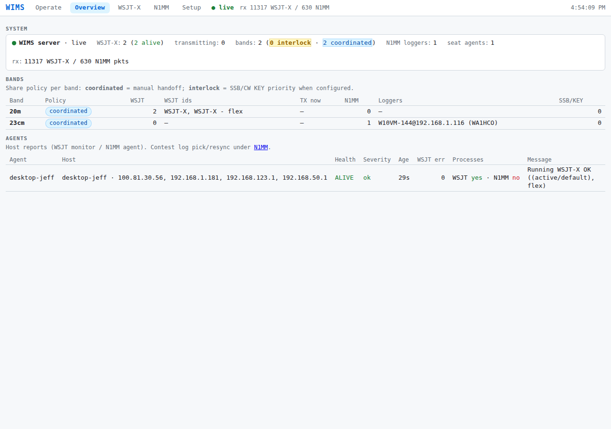
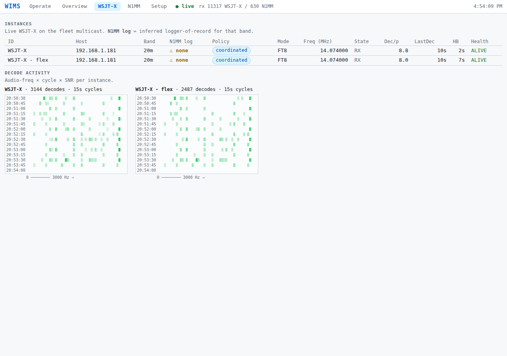
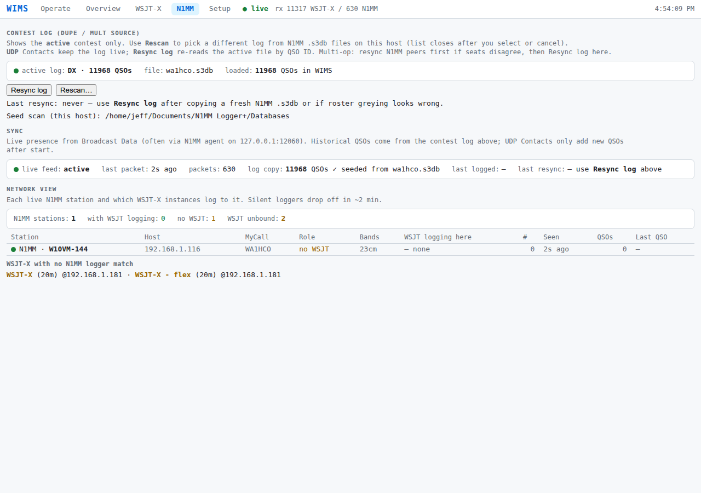

# WSJT-X Instance Management System (WIMS) — User Manual

**Audience:** contest operators and seat wranglers (W2SZ multi-multi VHF and similar).  
**Setup how-to (WSJT-X · N1MM · Keyline):** **[operator_setup.md](operator_setup.md)** ← start here for install/config.  
**Screenshots:** refresh with `scripts/capture-user-manual-shots.sh` (see [manual/README.md](manual/README.md)).  
**Related:** [tester_quickstart.md](tester_quickstart.md), [plan/wims_design.md](plan/wims_design.md), [plan/wims_networking.md](plan/wims_networking.md).

---

## What WIMS is for

WIMS is built for **multi-multi contesting**. The launch application is the **ARRL VHF/UHF contest**, but the same patterns apply wherever several WSJT-X instances and loggers share a LAN.

Contesting today is dominated by WSJT-X digital modes, while **SSB and CW** still matter. The usual practice is to switch between FT8 and SSB/CW rather than run both at once. That creates problems:

- Missed contacts in the mode not currently in use
- Time-consuming mode switches

At W2SZ we have learned that **FT8 can decode between SSB/CW transmissions** — call it **FT8 break-in**. The scenario: a second radio listens on the band’s FT8 frequency while the SSB/CW station calls CQ or works search-and-pounce.

### Preferred minimal FT8 break-in setup

- SSB/CW radio plus a second FT8 radio
- Receive split and routed to both radios
- Transmit paths through a selection relay
- KEY line from one radio controls the selection relay
- **WIMS keeps the two radios from transmitting at the same time**

To minimize SSB/CW workload, the FT8 radio listens continuously and reports **needed** decodes to a **call roster**. The SSB/CW operator can start WSJT-X working a station by **clicking a roster line**.

What’s new: the SSB/CW operator can keep calling CQ or answering S&P while WSJT-X works and logs a station. Interrupting the FT8 transmitter (via inhibit) is like losing pieces of a received signal — decoding at the DX end often still succeeds.

That overlap is the **inhibit** path: a beta/patched WSJT-X releases PTT when another radio’s KEY asserts (**TxInhibit type 18**).

### WIMS functions today

1. **Call roster** — needed stations; click to **Work** (answer)  
2. **Inhibit** — SSB/CW KEY → WSJT-X PTT release (N1MM agent **KEY** section + Keyline)  
3. **Logging** — WSJT-X Logged QSOs → N1MM via **N1MM agent Log**  
4. **Broadcast bridge** — N1MM Broadcast Data on localhost → site **N1MM** tab via **N1MM agent Broadcast**  

---

## Quick start

```bash
# Desktop launcher (recommended)
python -m wims
```

- **Windows:** Desktop **WIMS** / `Install-Wims.cmd` once — [scripts/windows/README.md](../scripts/windows/README.md)  
- **Linux:** `scripts/install-wims-desktop.sh` (needs `python3-tk`)  
- Console: `http://<server>:8787/`  

**Exact app settings:** [operator_setup.md](operator_setup.md).

The launcher has **Running on this PC** (live) and **This seat will run** (remembered intent):

| Intent | Starts |
|--------|--------|
| **N1MM** | **N1MM agent** — Broadcast + Log |
| **SSB/CW KEY** | same agent with **KEY** (pick KEY COM/tty in the launcher) |
| **WSJT-X** | WSJT monitor agent (`:8790`) |
| **Site server** | Fleet console (`:8787`) — one per LAN |

### Install / update (Windows)

1. Tree on disk (`git clone` or copy).  
2. **`scripts\windows\Install-Wims.cmd`** once.  
3. Day-to-day: Desktop **WIMS**.  
4. When offered: **Update WIMS** (does not auto-pull mid-contact).  

---

## Site console

One **site server** per contest LAN. Top nav:

**Operate · Overview · WSJT-X · N1MM · Setup**

### Operate (call roster)


*Operate — call roster. Click a line to Work (answer); Halt TX always available. Call CQ in WSJT-X.*

- Needs: WSJT multicast + N1MM contest log (seed and/or live Contacts via agent).  
- **Work** = answer that station. **CQ / run** = WSJT-X UI only.

### Overview · WSJT-X · N1MM

| Page | URL | Content |
|------|-----|---------|
| **Overview** | `/overview` | System, bands, agents, rotators |
| **WSJT-X** | `/wsjt` | Digi instances + decode activity heatmaps |
| **N1MM** | `/n1mm` | Contest log pick/resync + logger sync / network |

(`/status` still opens Overview.)







### Setup


*Setup — install diagnostics (networking, seat configs). Contest log is on **N1MM**.*

---

## N1MM agent (logger / SSB-CW PC)

One process: `python -m wims.seat --log --key` (or launcher intents).

| Section | Job |
|---------|-----|
| **Log** | Fleet digi Logged QSOs (`224.0.0.73:2237`) → local N1MM (`:52001` / `:2333`) |
| **Broadcast** | Hear N1MM **Broadcast Data** on `127.0.0.1:12060` → site `/api/n1mm/broadcast` |
| **KEY** | Keyline CTS → same-band type-18 holds |

**N1MM Configurer:** Broadcast Data **Radio + Contacts → `127.0.0.1:12060`**.  
**WSJT/JTDX UDP reader → OFF** (the agent Log section replaces it).  
Set `WIMS_SERVER=http://<site>:8787`. Not N1MM networking port **12070**.


*N1MM agent status window (Broadcast / Log / KEY).*

---

## WSJT monitor (digi PC)

Optional. Launcher **WSJT-X** intent → local UI `http://127.0.0.1:8790/` and rows under Overview **Agents**.


*WSJT monitor — config check for instances on this PC.*

---

## Inhibit / Keyline

- Pick **KEY device** in the launcher (COM / `/dev/tty…` / `sim:up`).  
- Hardware: [hardware/keyline_interface/](../hardware/keyline_interface/) · flash: [eeprom/README.md](../hardware/keyline_interface/eeprom/README.md).  
- Digi needs patched WSJT-X (type **18** hold; port **22372** or ephemeral via InhibitStatus).  


*KEY section — CTS and targets.*

Design: [plan/wims_key_agent.md](plan/wims_key_agent.md), [protocols/wsjtx_tx_inhibit.md](protocols/wsjtx_tx_inhibit.md).

---

## Networking (short)

Authoritative: [plan/wims_networking.md](plan/wims_networking.md).

| Plane | Address |
|-------|---------|
| WSJT fleet UDP | **`224.0.0.73:2237`** (all bands; unique `--rig-name` per instance) |
| N1MM Broadcast (fleet) | **`127.0.0.1:12060`** → N1MM agent → site |
| N1MM↔N1MM mesh | **12070** (not WIMS) |
| Site HTTP | **:8787** |
| WSJT monitor | **:8790** on that PC |

Tailscale on contest seats: deferred policy/audit — [plan/tailscale_contest_lan.md](plan/tailscale_contest_lan.md).

---

## Safety

- **Zero TX overlap** per resource group; fail-safe to RX.  
- **No automated/unattended transmit** — human initiates TX.  
- Restarting the launcher **replaces** N1MM agent / WSJT monitor but **leaves the site server alone**.  

---

## Keeping screenshots current

**Launcher → Screenshots…** (select pages, standard name or suffix), or:

```bash
scripts/capture-user-manual-shots.sh
scripts/capture-user-manual-shots.sh --suffix contest_run
```

See [manual/README.md](manual/README.md). Catalog: [manual/shots.json](manual/shots.json).  
Images: [manual/images/](manual/images/) — Markdown paths stay fixed when you refresh.

---

## Document history

| Date | Note |
|------|------|
| 2026-08-30 | Initial Markdown manual + screenshot manifest |
| 2026-09-05 | N1MM agent Broadcast/Log/KEY; console Overview/WSJT/N1MM; link operator_setup |
| 2026-09-05 | Screenshots panel (map144-style); overview/wsjt/n1mm embeds |
