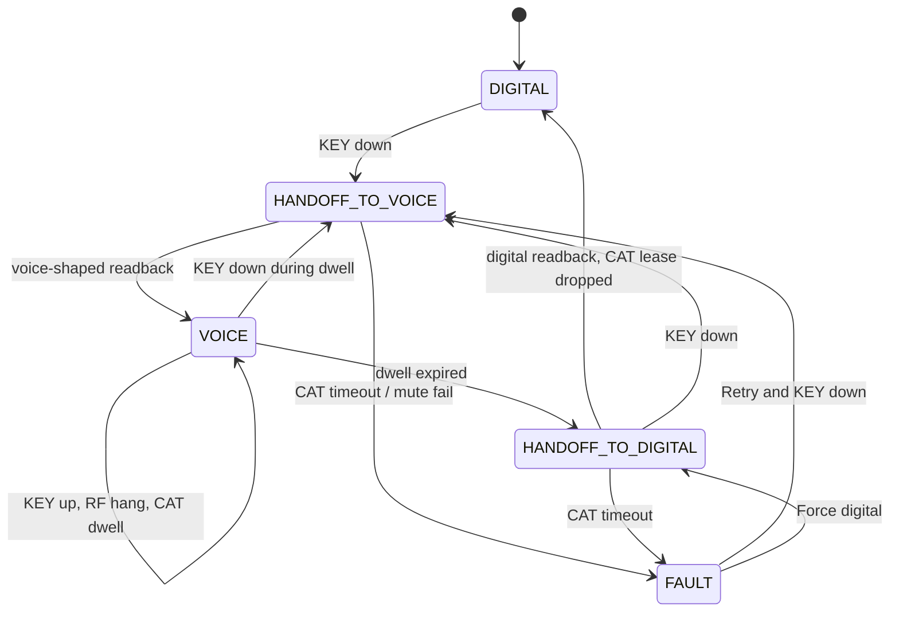

# Shared transceiver + second receiver

This file is the **feature design**. It is written in **STE Lite**: short
sentences, one idea per sentence, one word for one meaning. Technical
names (WSJT-X, Hamlib, KEY, CAT) stay as names.

Record adopted decisions in [`wims_design.md`](wims_design.md) when this
lands. This file does **not** replace the dual-radio fleet default
([`wims_tx_inhibit.md`](wims_tx_inhibit.md) §1).

| Field | Value |
|-------|--------|
| **Title** | Two station classes: one transceiver + separate RX, or one transceiver with dual RX. CAT profile handoff. |
| **Author** | WIMS design |
| **Date** | 2026-09-12 |
| **Revised** | 2026-09-13 |
| **Status** | Draft |
| **Style** | STE Lite (this is the main version) |

---

## 1. Two new station classes

WIMS adds **two** station classes. Both use **one transceiver** for TX.
Both keep digital decode during voice. They differ in the **second
receiver**.

| Station class | Transceiver | Second RX |
|---------------|-------------|-----------|
| **`shared_trx_second_rx`** | One radio for TX | **Separate RX only** (wideband SDR + virtual audio). Not the same radio. |
| **`shared_trx_dual_rx`** | One radio for TX | **Same radio**, dual-RX / dual-watch (example: IC-9700 SUB). |

Both classes:

- Transmit SSB, CW, **or** one WSJT-X mode on that transceiver. Not two
  at the same time.
- Keep FT8 / FT4 / MSK144 decode on the second RX while the transceiver
  is in voice.
- Use the same KEY → inhibit → mute → CAT → voice-permit sequence.

They are **not** the fleet default. The fleet default stays
**dual-radio** (one SSB radio and one WSJT-X radio).

Do **not** enable CAT unless the seat profile sets one of these two
classes. `--cat` is a hard error on any other class (including missing
class). Do **not** infer the class from the hostname.

In this file, **shared-trx** means either of these two classes.

`station_class` enum:
`dual_radio` | `single_radio` | `shared_trx_second_rx` | `shared_trx_dual_rx`.

Only the last two enable `--cat`.

---

## 2. Why these classes exist

WIMS today assumes dual-radio: an SSB/CW transmitter and a WSJT-X
transmitter, antenna-split so both receive. Inhibit gates digital PTT so
only one signal radiates. WIMS does not send CAT on dual-radio.

On a typical 222 / 432 seat there is **one** transceiver.

Problems without a shared-trx class:

1. One transceiver cannot listen to three digital dials at the same time.
2. The voice operator needs that transceiver **now**. The operator must
   not click a second control.
3. Inhibit can stop digital PTT. Inhibit does **not** retune the radio.
   The radio can stay in data mode on the digital dial.
4. If the footswitch keys the radio while WSJT-X still sends USB audio,
   the radio can radiate FT8 audio in voice. Dual-radio inhibit does not
   have this risk.
5. The operator cannot talk until the radio is in voice mode.

The second receiver solves (1). Use **`shared_trx_second_rx`** when that
RX is a separate SDR. Use **`shared_trx_dual_rx`** when the transceiver
already has a second RX.

Inhibit + TX-audio mute + SEND gate solve (4). CAT profile switch solves
(3) and (5). KEY is still the only operator action for (2).

The 222/432 “shared radio” row in networking is **not** this design until
a second RX, `--cat`, RTS PTT, mute, and SEND wiring are declared.

---

## 3. What WIMS must do

WIMS must keep **one radiated signal** on this transceiver.

WIMS must:

1. Stop digital RF first (inhibit + mute).
2. Then switch the radio to the voice profile.
3. Then permit the human SEND line.
4. On unkey: wait CAT dwell, then restore the digital profile, then
   release digital TX.

WIMS must **not**:

- Open the radio COM / CI-V port. wfview owns that port.
- Key SSB or CW. The human keys the radio.
- Start CAT on a dual-radio seat.
- Replace WSJT-X, N1MM, or the logger.
- Drive SDR tuning as a WIMS product.
- Put CAT on the site server.

On shared-trx only, a seat-local coordinator is a **Hamlib NET client**
of named middleware (wfview RigCtld). WIMS is still not a server-plane
CAT protocol.

---

## 4. Hardware picture

```
Antenna ── T/R / amp ── Transceiver (one TX path)
               │            │
               │            │  wfview owns COM → RigCtld :4533
               │            │  WIMS proxy :4532 is the only Hamlib peer
               │            └── Seat PC: wfview, N1MM, one TX WSJT-X,
               │                wims.seat --log --key --cat
               │
               ├── shared_trx_second_rx: coupler → SDR → decode-only WSJT-X
               └── shared_trx_dual_rx:   same radio RX2 / dual-watch
                                         → decode-only WSJT-X
```

v1 assumes **co-located** wfview + TX-capable WSJT-X + `wims.seat --cat`.
The proxy binds on that PC (`127.0.0.1:4532`) and forwards to RigCtld.
Layer-2 mute must run on the host that owns the TX USB codec.

### How the two classes differ

Decode-only WSJT-X instances always use `rf_path=sdr_rx`. CAT and KEY
handoff are the same. Protection and audio are not.

| Class | Second RX hardware | Protection | Decode audio |
|-------|--------------------|------------|--------------|
| **`shared_trx_second_rx`** | Separate SDR only | External T/R or limiter (`sequencer`) | Virtual audio / IQ from the SDR. Many modes at the same time. |
| **`shared_trx_dual_rx`** | Same transceiver dual RX | Radio T/R (`radio_tr`). Do not hot-switch RX2. | Radio 2nd-RX USB / codec. WIMS does **not** tune RX2. |

Do **not** set `shared_trx_dual_rx` on a radio that has only one RX.
Do **not** set `shared_trx_second_rx` if the only second RX is the
radio’s own dual-watch.

Class **is** the discriminator. Optional `second_rx.kind` (`sdr` or
`trx_rx2`) must match the class if present. Mismatch is a readiness
error.

### One TX-capable WSJT-X

There must be **exactly one** WSJT-X instance that can transmit on this
band. That instance uses the transceiver (`rf_path=trx`,
`tx_capable=true`). Usual TX instance: FT8.

All other digital instances decode only on the second RX
(`rf_path=sdr_rx`, `tx_capable=false`).

To run MSK144, change the profile so that one instance is TX-capable.
Do **not** arm two sequencers on one PTT line.

Inhibit targets = `rf_path=trx` **and** `tx_capable=true` **and** a live
type-17 inhibit port. Do **not** send holds to decode-only instances.

### Compare to other patterns

| | Dual-radio (default) | Single-radio SO1R WSJT | Shared-trx (both new classes) |
|--|----------------------|------------------------|-------------------------------|
| TX hardware | Two exciters | One radio | **One transceiver** |
| Digital RX during voice | WSJT radio keeps receiving | None | **Second RX keeps decoding** |
| Inhibit | Necessary and sufficient | N/A | **Necessary, not sufficient** |
| TX-audio mute | Fallback | n/a | **Mandatory with first hold** |
| Human SEND | Keys the voice radio | Manual | **AND-gate: footswitch × Keyline J3** |
| CAT from WIMS | Forbidden | Unused | **Seat-local Hamlib client** |

---

## 5. Safety wiring (required)

### Digital PTT

Digital PTT is **gated serial RTS/DTR**. It is **not** CAT PTT.

The inhibit gate in patched WSJT-X sets:

`RTS = (WSJT-X wants TX) AND (inhibit is off)`

The fleet Icom recipe uses CAT PTT. This class **must** rewire to RTS.

### Human PTT (AND-gate pack)

This pack is **required**. It is **not** wired yet. Design it. Do not
ship `--cat` with a parallel footswitch-to-SEND.

| Line | Function |
|------|----------|
| Keyline **J1 → CTS** | Sense KEY / PTT (existing KEY read) |
| Keyline **J3 ← RTS** | Voice permit. Same COM handle as CTS. Not a second open. |
| Radio SEND | **AND**(footswitch, J3) |

Rules:

- Assert J3 RTS **only** after the radio is in voice profile.
- Do **not** use DTR for permit. J3 is RTS only.
- The permit COM must **not** be the WSJT-X PTT COM.
- Dual-radio leftover: J3 as TX-inhibit to the other radio = **error**.
- Parallel footswitch to SEND = **not** v1.
- Windows: `EscapeCommFunction(SETRTS/CLRRTS)` on the existing handle.
- Linux: `TIOCMBIS` / `TIOCMBIC` with `TIOCM_RTS`.
- `CtsSource.set_rts(permit)` is new. Default is permit down on open
  and close. Never a second `CreateFile` of the KEY COM.

### TX audio mute

Before CAT starts, mute the **TX-capable WSJT-X session**.

| Item | v1 rule |
|------|---------|
| OS | Windows contest seats |
| API | WASAPI `ISimpleAudioVolume` on the **session** (ctypes COM). Not endpoint mute. Not `pycaw`. |
| Which session | TX-capable WSJT-X only. Device from that instance’s SoundOut. Process: `wsjtx.exe` with `--rig-name=<id>`. |
| Ramp | Step session volume on a mute thread. Hard cut is forbidden. |
| Ready | Session **open** + one test ramp at `--cat` start |
| Failure | Session missing → **FAULT**. Holds stay. Permit down. Do not unmute a session we never muted. |
| Unmute | **Only** after digital CAT readback is good |

Module: `src/wims/audio/mute.py`. Must land before `--cat` integration.

### Second RX protection

`sdr_protection` must be set. Unspecified = **error**.

- `shared_trx_second_rx`: external sequencer or limiter (`sequencer`).
- `shared_trx_dual_rx`: radio T/R (`radio_tr`).

Dummy-load **class gate**: KEY while WSJT-X is mid-over, AND-gate pack,
spectrum for t=0…voice-shaped. **Fail the class if digital RF
reappears.**

---

## 6. Operator sequence

There is **one** gesture: press and hold the footswitch (or key).
Not N1MM `IsTransmitting`. Not a console button in v1.

### KEY down

1. WIMS samples CTS (today: poll about 50 ms).
2. WIMS sends inhibit to the TX-capable WSJT-X (`{host}-key` and
   `{host}-cat`). Two Controller IDs. Gate OR is already tested.
3. WIMS mutes TX USB audio.
4. Voice permit stays **down**. Radio SEND cannot close yet.
5. UI shows **HANDOFF**. Do **not** talk yet. This is **RF-safe**.
6. Proxy goes to COORD. WIMS applies the voice CAT profile.
7. If readback is good: UI shows **VOICE**. WIMS asserts J3. Held PTT
   keys the radio. This is **voice-shaped**.
8. If CAT takes more than 500 ms, or mute fails: UI shows **FAULT**.
   Digital TX stays inhibited. Permit stays down.

The second RX continues to decode during all of this.

### KEY up

1. RF hang: CW uses 10.5 × dit (clamp 0.315–1.260 s). SSB hang is 0.
   This releases only the KEY inhibit lease.
2. Radio **stays in voice** for CAT dwell (default 0.5 s, clamp
   0.3–1.0 s). This stops mode change on every SSB syllable.
3. If KEY goes down during dwell: stay in VOICE.
4. After dwell: permit down. Apply digital CAT. Digital VFO = WSJT-X
   Status **dial**, not Fake-It TX offset.
5. If readback is good: unmute. Release CAT inhibit. UI shows DIGITAL.
6. WSJT-X transmits again only if Enable Tx was already on. WIMS does
   not start a new QSO.

### Force / Retry

Use these only from **FAULT**.

- **Retry:** apply the profile that KEY level needs (down = voice,
  up = digital). Skip CAT dwell.
- **Force digital:** apply digital profile. Drop CAT lease only after
  readback is good. Never drop `{host}-cat` on an unknown VFO.

### Wire states

`DIGITAL` | `HANDOFF_TO_VOICE` | `VOICE` | `HANDOFF_TO_DIGITAL` | `FAULT`

CAT dwell after SSB unkey is still **VOICE** until dwell expires. Console
may show `VOICE (dwell)` as a sublabel. That is not a fifth wire state.

| State | KEY lease | CAT lease | Proxy | Mute | Voice-permit | Human SEND RF |
|-------|-----------|-----------|-------|------|--------------|---------------|
| `DIGITAL` | open | open | PASS | off | down | no |
| `HANDOFF_TO_VOICE` | hold | hold | COORD | on | down | **no** |
| `VOICE` | hold while keyed + RF hang | hold | BLOCK | on | **up** | **yes** |
| `HANDOFF_TO_DIGITAL` | open after RF hang | hold | COORD | on until restore OK | down | no |
| `FAULT` | hold if keyed | **hold** | BLOCK | on | down | front panel only; digital TX **no** |



---

## 7. CAT (shared-trx classes only)

WIMS does **not** open COM. A seat-local coordinator is a **Hamlib
client** of wfview RigCtld, through a **WIMS proxy**.

```
WSJT-X  →  WIMS proxy :4532  →  wfview RigCtld :4533
Coordinator → same proxy
N1MM CI-V  →  wfview (not through the proxy)
```

| Proxy mode | WSJT-X SET | Coordinator SET | Use |
|------------|------------|-----------------|-----|
| **PASS** | forward | idle / GET only | DIGITAL |
| **COORD** | ACK, do not forward | forward | HANDOFF, FAULT recovery |
| **BLOCK** | ACK, do not forward | none | VOICE after apply, FAULT idle |

Do **not** send NAK (`RPRT -1`) to parked SET. WSJT-X can retry or Halt.
Send `RPRT 0` and do not forward.

Parked GET returns the **cached digital** snapshot (dial, digital mode,
PTT 0, split off). Handshake (`dump_state`, `chk_vfo`) must forward or
replay a captured template. Never empty-ACK.

v1 CAT stack: **Icom + wfview RigCtld**. Flex is reserved. Stdlib TCP.
Zero new runtime deps.

CAT master by phase:

- DIGITAL → WSJT-X via proxy PASS
- HANDOFF / FAULT → COORD
- VOICE → apply once, then idle. N1MM / front panel own VFO

If HANDOFF readback ≠ commanded profile → FAULT.

N1MM on a shared-trx class (readiness **error** if not true):

- Port type: TCP to wfview (not COM)
- PTT via radio command: **OFF**
- CW via radio command: **OFF**
- Set radio / QSY to radio: **OFF** while digital owns the radio
- Load WSJT/JTDX / DX Lab proxy: **OFF**

### Apply set (v1)

Skip width / NR / NB unless the seat profile sets them.

1. `T 0` (does **not** override hardware SEND).
2. Split off.
3. Mode only (`M <token>` from the seat profile, not a hard-coded
   `M USB 2400`).
4. VFO A `F <cat_hz>`. Digital: **dial** CAT Hz.
5. Readback `t` / `m` / `f` / split. Freq ±50 Hz. Mode exact. PTT 0.
   Mismatch → FAULT.

Timeouts:

| Step | Timeout | On expiry |
|------|--------:|-----------|
| Proxy↔RigCtld connect | 200 ms | FAULT; leases held |
| Each SET + `RPRT` | 80 ms, retry once | FAULT |
| Full apply | **500 ms** | FAULT; do **not** drop `{host}-cat` |
| CAT keepalive | ≤100 ms | own thread |

Do **not** wait for Status `transmitting=false`. Do **not** wait for
type-17 before CAT. RF-safe is hold + mute, not CAT.

Digital restore frequency = plane-A Status `dial_hz` mapped to CAT Hz
(transverter IF offset if needed). Ignore Hamlib `f` while
`transmitting=true` (Fake It TX offset).

Voice memory = N1MM RadioInfo **only while** `handoff.state==VOICE`.
RadioInfo during DIGITAL must **not** update voice memory.

Transverter: 222 CAT 21 MHz + 201 MHz LO; 432 CAT 28 MHz + 404 MHz.
Store CAT Hz + RF Hz. Apply CAT Hz.

KEY sense must **not** wait on CAT sockets. `{host}-cat` is
level-triggered (`hang_s=0`). Default CAT TTL **1500 ms**, keepalive
**200 ms**, own poll thread ≤100 ms.

---

## 8. Inhibit vs CAT clocks

Do not mix these times.

| Clock | What | Target |
|-------|------|--------|
| **RF-safe** | Inhibit sent + RTS gated + audio muted | About 50 ms poll + 1–2 ms gate |
| **CAT start** | After local hold + mute. Do not wait for type-17. | Start at once |
| **Voice-shaped** | Hamlib USB/CW + split off + PTT 0 | Target 250 ms typical, 500 ms max. 500 ms = FAULT |

Voice-shaped is **not** “mic live at t=0.” UI must show HANDOFF until
voice-shaped.

CAT dwell (0.5 s) is **not** RF hang. Dual-radio SSB hang 0 stays
correct there because that class does not retune.

250 ms / 500 ms is a **target** until the IC-9700 dummy-load bench fills
analog-path lag. There is **no** delay knob.

---

## 9. Work on the Operate console

If `station_class` is **not** `shared_trx_second_rx` and **not**
`shared_trx_dual_rx` (missing class included): Work and grouping stay
**as today**. Dual-radio must not change.

If the class **is** one of the two shared-trx classes:

- Deny Work unless handoff state is **DIGITAL**.
- Deny Work on decode-only (`sdr_rx`) instances. Halt does nothing there.
- Deny Work if `tx_capable` is explicit false.
- Group the one TX-capable transceiver instance in `resource_group`
  (example: `2m-signal`).

Unset `tx_capable` defaults **true** so additive JSON cannot fail-close
the fleet.

---

## 10. Policy: interlock vs coordinated

| Policy | Shared-trx classes | Dual-radio KEY in these PRs |
|--------|--------------------|-----------------------------|
| **interlock** (default here) | Inhibit + mute + CAT | Unchanged (holds if `--key`) |
| **coordinated** | **No** inhibit for priority, **no** mute for priority, **no** CAT. UI: one-signal is on you. | **Unchanged** (still holds if `--key` — known SoT gap, separate PR) |

---

## 11. Seat profile

File: `%LOCALAPPDATA%\WIMS\seat-profile.json` (or launcher sibling).
Consumed by **`wims.seat`**. Gitignore the live file. Commit an example.

Unset / missing `station_class` → no CAT. Same-band inhibit as today.

Readiness **error** if a shared-trx class is set on a pack that still
starts a **separate** SSB radio, or if TX-capable WSJT-X Network Server
is still `:4533`.

Example: **`shared_trx_second_rx`** (SDR).

```json
{
  "station_class": "shared_trx_second_rx",
  "resource_group": "2m-signal",
  "share_policy": "interlock",
  "cat_dwell_s": 0.5,
  "transceiver": {
    "rig_model": "IC-9700",
    "cat_path": "wfview-rigctld",
    "rigctld_host": "127.0.0.1",
    "rigctld_port": 4533,
    "proxy_bind": "127.0.0.1:4532",
    "ptt_method_digital": "RTS",
    "ptt_device": "COM7",
    "if_offset_hz": 0,
    "sdr_protection": "sequencer",
    "human_ptt": {
      "sense": "keyline_cts",
      "radio_send": "wims_permit",
      "voice_permit": "keyline_rts",
      "j3_role": "voice_permit",
      "tx_audio_mute": "wasapi_session"
    },
    "n1mm_set_radio": false,
    "n1mm_ptt_via_radio": false,
    "n1mm_cw_via_radio": false
  },
  "second_rx": {
    "label": "SDRPlay-144"
  },
  "wsjt_instances": [
    {"id": "TRAILER-144-FT8", "rf_path": "trx", "tx_capable": true, "modes": ["FT8"]},
    {"id": "TRAILER-144-FT4", "rf_path": "sdr_rx", "tx_capable": false, "modes": ["FT4"]},
    {"id": "TRAILER-144-MSK", "rf_path": "sdr_rx", "tx_capable": false, "modes": ["MSK144"]}
  ],
  "voice": {
    "n1mm_station": "TRAILER-144",
    "mode": "USB",
    "default_profile": {"cat_hz": 144200000, "mode": "USB", "split": false}
  },
  "digital": {
    "mode": "PKTUSB",
    "default_dial_rf_hz": 144174000
  },
  "key": {
    "controller_id": "TRAILER-144-key",
    "cat_controller_id": "TRAILER-144-cat",
    "cat_ttl_ms": 1500,
    "cat_keepalive_s": 0.2
  }
}
```

Dual-RX seat: set `"station_class": "shared_trx_dual_rx"`,
`"sdr_protection": "radio_tr"`, `"second_rx": {"label": "IC-9700-RX2"}`.
CAT and KEY stay the same. Decode audio comes from radio RX2.

`ptt_device` is **WSJT-X’s** gated PTT port. WIMS never opens it.
`j3_role` must be `voice_permit`. `tx_inh` is a readiness error.
Observed Status `tx_role` (`idle` / `snp_wims` / `run_local` / `qso`)
must **not** appear in this profile.

### State contract

Additive. `API_VERSION` stays 1. Seat POSTs `/api/agents/report`
(`kind=n1mm_seat`). Do **not** route through `wims.agent`.

Per band:

```
station_class, resource_group, handoff {state, dwell, rf_safe,
voice_shaped, age_ms, voice_rf_hz, digital_rf_hz, cat_ok, proxy,
voice_ready_ms, detail}, ssb [{id, keyed, holding}]
```

Per WSJT instance: `rf_path`, `tx_capable`, `resource_group`, existing
`tx_role`.

### Seat / launcher

- Intent checkbox **CAT handoff** in `seat_intent.json`.
- `python -m wims.seat --log --key --cat`
- Lab only: `python -m wims.cat` (get/apply against corpus). Not a
  product CAT server.
- Pack: `scripts/windows/radio-shared-trx-2m.example.cmd`. Network
  Server = proxy `:4532`. `PTT=RTS`. Exactly one TX-capable
  `--rig-name`. J1 = CTS, J3 = voice-permit. Do **not** reuse
  `Start-Seat-IC9700-144.cmd` (`:4533` direct).

---

## 12. UI (tired operator)

1. Digital runs. Second-RX waterfalls keep moving.
2. SSB operator **presses and holds** the footswitch. That is the only
   action.
3. Badge **HANDOFF**. RF-safe. SEND still gated.
4. Badge **VOICE**. Permit up. Held PTT keys the radio. First syllable
   can wait for CAT. This is honest.
5. Unkey. Radio stays voice for 0.5 s dwell.
6. Restore digital dial. Next FT8 cycle can radiate only if Enable Tx
   is still on.

Console band badge: `TRX+SDR` or `TRX+RX2` plus state
(`DIGITAL` / `→VOICE` / `VOICE` / `→DIGI` / `FAULT`).

Distinguish **RF-safe** vs **voice-shaped**. FAULT is red. Force digital
/ Retry only from FAULT.

Seat **CAT** line examples:

- `CAT · VOICE · 144.200 USB · permit UP · proxy BLOCK`
- `CAT · HANDOFF · muted · applying USB`
- `CAT · FAULT apply timeout — digital held`

---

## 13. Readiness (fail closed)

Do not actuate `--cat` unless all of these pass:

| Check | Else |
|-------|------|
| Class is `shared_trx_second_rx` or `shared_trx_dual_rx` | `--cat` hard error |
| RigCtld LISTENING | no CAT |
| Proxy bind; TX WSJT-X.ini Network Server = proxy | **error** if still `:4533` |
| TX instance PTT RTS/DTR in ini | **error** |
| Type-17 from the TX instance | **error** — unpatched + shared-trx is **unsafe** |
| Mute session open + test ramp | **error** |
| `human_ptt.radio_send` is `wims_permit` | **error** |
| Permit COM ≠ `ptt_device`; permit is KEY-handle RTS | **error** |
| J3 not leftover TX-INH / no separate SSB radio | **error** |
| Second RX matches the class | **error** |
| `sdr_protection` matches the class | **error** |
| Exactly one `trx` + `tx_capable` | **error** if 0 or ≥2 |
| `n1mm_*` radio PTT/CW/set attested false | **error** |
| At least one `sdr_rx` heartbeat | **warn** |
| KEY device | existing |

---

## 14. Modules

| Module | Role |
|--------|------|
| `src/wims/cat/hamlibnet.py` | Codec from wfview capture |
| `src/wims/cat/proxy.py` | Sole peer of RigCtld. PASS / COORD / BLOCK |
| `src/wims/cat/profile.py` | Apply / readback / IF offset / dial vs `f` |
| `src/wims/cat/runtime.py` | CAT I/O thread + CAT-lease keepalive. Not on KEY poll |
| `src/wims/audio/mute.py` | WASAPI session mute (ctypes) |
| `src/wims/interlock/handoff.py` | Pure machine |
| `src/wims/integrations/wsjtx_config.py` | Rig, Network Server, PTT, SoundOut |
| `src/wims/key/cts.py` | `set_rts(bool)` on the existing handle |

No new plane-A types. Type-18 unchanged. No SQLite change.

---

## 15. What we will not do (v1)

- Replace Trailer-50 / Trailer-144 dual-radio.
- Put CAT on the site server.
- Let WIMS key SSB/CW.
- Drive SDR tuning as a WIMS product.
- Flex SmartSDR CAT in v1.
- Guarantee 250 ms voice-shaped before the IC-9700 dummy-load bench.
- Support parallel footswitch-to-SEND.
- Infer class from hostname.
- Collapse the two classes into one class + a kind flag.

---

## 16. Decisions (locked)

| # | Decision |
|---|----------|
| **KD1** | Two classes: `shared_trx_second_rx` and `shared_trx_dual_rx`. Dual-radio remains default. Unset class = no CAT. Do not infer from hostname. Class is the discriminator, not `second_rx.kind`. |
| **KD2** | Invariant 7 rewrite for shared-trx only: WIMS never opens COM/CI-V. Seat-local Hamlib **client** of named middleware. Never keys SSB/CW. `--cat` hard error if class is neither shared-trx value. |
| **KD3** | Handoff order: KEY → inhibit TX-capable → mute → park WSJT CAT → voice CAT → voice-shaped. Reverse: RF hang → CAT dwell → digital CAT from Status dial → drop CAT lease. |
| **KD4** | Two type-18 IDs: `{host}-key` and `{host}-cat`. CAT lease is level-triggered on its own thread. KEY sense never waits on CAT sockets. |
| **KD5** | Digital PTT = gated serial RTS/DTR, not CAT PTT. |
| **KD6** | Hamlib proxy is the single TCP peer of wfview. Parked SET → `RPRT 0` without forwarding. PR4 must not merge until a live wfview capture exists. |
| **KD7** | CAT master by phase. N1MM radio PTT/CW/set = OFF (readiness error). Bad HANDOFF readback → FAULT. |
| **KD8** | Two classes, one decode role (`rf_path=sdr_rx`). Inhibit targets = trx + tx_capable. Do not reuse JSON key `tx_role`. |
| **KD9** | Three clocks: RF-safe, CAT start, voice-shaped. Apply timeout 500 ms = FAULT. No delay knob. |
| **KD10** | v1 CAT stack = wfview-rigctld (Icom USB). Flex reserved. |
| **KD11** | This class defaults to `interlock`. Coordinated: no type-18, no CAT, no mute-for-priority. Dual-radio KeyRuntime unchanged in these PRs. |
| **KD12** | Coordinator runs on the radio/wfview PC in `wims.seat --cat`. Not the site server. Seat POSTs `/api/agents/report`. |
| **KD13** | Human PTT must not radiate digital audio. AND-gate pack is required. Voice-permit = RTS on the existing KEY handle. Parallel SEND is not v1. |
| **KD14** | Digital restore frequency = Status `dial_hz`. Ignore Hamlib `f` while transmitting. |
| **KD15** | CAT dwell ≠ RF hang. Default dwell 0.5 s. KEY-down aborts dwell. |
| **KD16** | Work-deny and grouping extra rules apply **only** if class is one of the two shared-trx values. Missing class → today’s Work. Unset `tx_capable` → true. |
| **KD17** | Mute = WASAPI session `ISimpleAudioVolume`. Not endpoint mute. FAULT if session missing. Module before `--cat` integration. |
| **KD18** | Exactly one TX-capable WSJT-X per band / resource group. |

---

## 17. Build order

Feature is **off** unless class + `--cat`. Each PR leaves `tests/unit`
green.

1. **PR1** — Profile enum (both classes), `rf_path`, empty `handoff`.
   No Work-deny. No CAT I/O. Dual-radio Work unchanged.
2. **PR2** — Hamlib codec + RadioProfile. Lab CLI. May use a synthetic
   peer. Live capture is a gate for PR4.
3. **PR3** — `HandoffMachine` (pure). Dwell, FAULT, Force/Retry.
4. **PR4** — Hamlib proxy. **Depends on PR2 and a live wfview capture.**
5. **PR5a** — Inhibit target filter + `{host}-cat` lease thread. No CAT
   I/O. Exactly one trx TX-capable.
6. **PR5-mute** — WASAPI session mute. **Must merge before PR5b.**
7. **PR5b** — `wims.seat --cat`: apply, J3 RTS permit, seat report.
8. **PR6** — Class-scoped Work deny + console. Unit-test: dual-radio
   fixture with no handoff blob still Works.
9. **PR7** — Dummy-load class gate, seat pack, operator docs, rewrite
   networking invariant 7.

Rollback: remove class / stop `--cat`. Point WSJT-X at `:4533`. Manual
mode switch. No database to revert.

Tests (stdlib): `test_handoff.py`, `test_audio_mute.py`, `test_key_cts.py`
(`set_rts`), `test_server_tx.py` (dual-radio still Works),
`test_hamlibnet.py`, `test_cat_proxy.py`, `test_cat_profile.py`,
`test_key_discovery.py`, `test_server_state.py`, `test_wsjtx_config.py`.

---

## 18. Main risks

| Risk | Control |
|------|---------|
| Footswitch radiates FT8 in HANDOFF | AND-gate + mute. Dummy-load must fail the class if digital RF returns. |
| Restore Fake-It offset | Restore Status **dial**, not TX frequency. |
| CAT stall opens digital PTT | Separate CAT lease thread. TTL 1500 ms. |
| SSB mode thrash | CAT dwell 0.5 s. |
| WSJT-X Halt on NAK | ACK, do not forward. |
| N1MM sets VFO in HANDOFF | Readiness error + FAULT on bad readback. |
| `--cat` on dual-radio | Hard error. |
| Work deny breaks dual-radio | Extra deny only if class is set. Test that. |
| Mute wrong device | Session mute only. FAULT if session missing. |
| Two TX sequencers | Exactly one `trx` + `tx_capable`. |
| One class + kind flag | Two classes. Class is the discriminator. |

---

## 19. Alternatives (short)

| Option | Result |
|--------|--------|
| Keep CAT in wfview macros; WIMS only inhibits | Reject as product. Keep as FAULT fallback. |
| N1MM owns CAT; WSJT-X VOX | Reject. |
| Dual-radio only (no feature) | Reject as the product answer. Keep as fleet default. |
| Disconnect WSJT-X CAT (no proxy) | Reject. Proxy is the disconnect. |
| CAT on the site server | Reject. |
| Mute + inhibit only; CAT optional | Defer as FAULT/coordinated. Mute is mandatory **with** CAT. |
| Coordinator only through the proxy | **Adopt.** |
| Parallel footswitch-to-SEND | **Not v1.** AND-gate is required. |

---

## 20. Locked answers (2026-09-13)

1. Second RX: **two classes.** `shared_trx_second_rx` = separate SDR
   only. `shared_trx_dual_rx` = same radio dual-RX. Decode role is still
   `rf_path=sdr_rx`.
2. TX-capable WSJT-X: **exactly one**, usually FT8.
3. Analog lag after DATA↔USB/CW: **unknown**. No delay knob.
4. Footswitch: **AND-gate required**. Not wired yet. Parallel not v1.
5. wfview capture: **unknown today**. Proxy PR waits for a live capture.

---

## 21. References

- [`wims_design.md`](wims_design.md) — §2.12 `tx_role`, §2.13, §2.14, §3.4, §3.14
- [`wims_networking.md`](wims_networking.md) — §1.0, §3.2–§3.3, §11.7
- [`wims_tx_inhibit.md`](wims_tx_inhibit.md) — dual-radio, gate, mute
- [`../protocols/wsjtx_tx_inhibit.md`](../protocols/wsjtx_tx_inhibit.md) — type-18
- [`wims_key_agent.md`](wims_key_agent.md), [`wims_switchboard_concept.md`](wims_switchboard_concept.md) §3
- [`../operator_setup.md`](../operator_setup.md)
- [`../decisions/2026-09-12-transverter-if-and-n1mm-khz.md`](../decisions/2026-09-12-transverter-if-and-n1mm-khz.md)
- Code: `src/wims/interlock/`, `src/wims/key/`, `src/wims/seat/app.py`,
  `src/wims/server/state.py`, `src/wims/core/bands.py`
