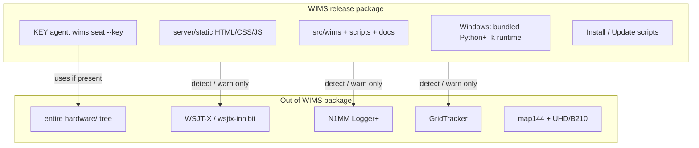
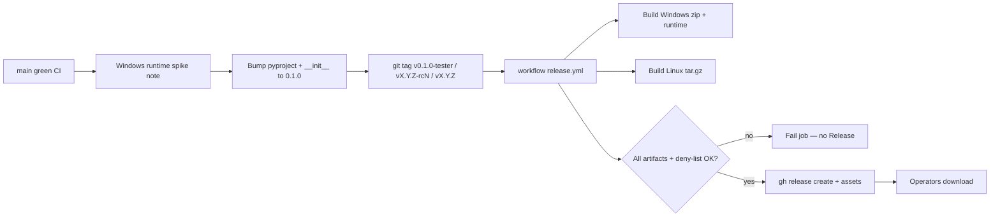

# Design: Contest-seat release packages (WIMS primary)

| Field | Value |
|-------|-------|
| **Author** | (draft for Jeff Millar, WA1HCO) |
| **Date** | 2026-09-07 |
| **Status** | Draft (rev 4 — open questions resolved by operator 2026-09-07) |
| **Primary product** | WIMS (`/home/jeff/ham/wims`) |
| **Adjacent (out of v1 scope)** | map144; Keyline EEPROM/flash/udev tools |
| **Process prior art** | wsjtx-inhibit tag → CI → GitHub Releases |

---

## Overview

Contest PCs at W2SZ already run WSJT-X (or wsjtx-inhibit) and N1MM+. Operators need a **versioned, offline-capable WIMS install** that does not break those apps. Today WIMS is a source tree plus `Install-Wims.ps1` (system Python via winget/download, `git pull` updates). CI validates only; there are no release artifacts.

This design defines **release packages** for Windows (primary) and Linux (secondary). The installer story centers on **dependency policy**: what is bundled, what is assumed present, and what is detected but never installed. Packaging reuses the **wsjtx-inhibit release process** (tag → CI gate → GitHub Releases). It does **not** reuse CMake/CPack/NSIS as the WIMS toolchain.

**Contest Windows default install root:** `C:\WIMS`.  
**Release zips hard-omit** the entire `hardware/` tree.  
**First public tag:** `v1.0.0` (GA). Earlier design draft used `v0.1.0-tester`.

---

## Background & Motivation

### Current state (verified)

| Area | Today |
|------|--------|
| Runtime | stdlib Python ≥3.10; `dependencies = []` in `pyproject.toml` |
| UI | Browser console (static files under `src/wims/server/static/`); optional Tk launcher |
| Windows install | `scripts/windows/Install-Wims.cmd` → `Install-Wims.ps1`: finds/installs Python, optional Git clone, firewall TCP 8787, writes `python-path.txt`, regenerates `Start-WimsServer.cmd`, smoke `import wims.server.app` → `import ok` |
| Python pin consume | Most `.cmd` launchers call `_resolve-python.cmd`, which reads `python-path.txt` then falls back to common paths / `py` / `python` |
| Windows update | `Update-Wims.ps1`: `git pull --ff-only origin/main` when `.git` exists. Startup (`check_for_update`) also queries **GitHub Releases**; ZIP / no-git trees get the banner and open the release URL. Tag `v*` publishes; push to `main` does not. |
| Local seat configs (gitignored) | `scripts/windows/seat-common.cmd`, `seat-local.cmd`, `radio-flex50.cmd`, `radio-ic9700-144.cmd`, `python-path.txt` |
| Linux | `apt install git python3 python3-tk`; run from tree; `scripts/install-wims-desktop.sh` |
| CI | `.github/workflows/ci.yml` → `scripts/validate.sh` on 3.10/3.12/3.14; version pin `pyproject.toml` ↔ `wims.__version__` |
| Releases | [`v1.0.0`](https://github.com/wa1hco/WIMS/releases/tag/v1.0.0); Windows bundled runtime still later |
| KEY software | IN product: `wims.seat --key` (N1MM agent KEY section) |
| Keyline hardware tools | OUT of software package: entire `hardware/` (EEPROM flash, `*.bin`, `99-keyline.rules`, KiCad) |

### Pain points at contest seats

1. **Offline / poor internet** — Installer may need to download python.org or use winget. Mountain sites often cannot.
2. **`git pull` updates** — ZIP/USB trees have no `.git`. Update path fails. Rolling `main` is not a pinned contest build.
3. **Tired operators** — Need one-click or near it. Multi-step “install Python, then clone, then firewall” fails under fatigue.
4. **Old Windows** — Missing admin for firewall, Store stub `python.exe`, no winget, old PowerShell 5.1 only (already targeted).
5. **Coexistence** — Must not overwrite WSJT-X/N1MM paths, settings, or UDP ports.

### What we keep from wsjtx-inhibit

Reusable **process**, not toolchain:

- Tag-driven publish (`build/v*` there; WIMS uses `v*` — see Tag scheme).
- CI builds artifacts; **all-platforms-ready gate** before GitHub Release upload via **`gh release create`** (or equivalent upload; gate policy is the reused idea).
- Side-by-side install relative to official apps.
- Operator docs that name exact asset filenames.

Not a fit for WIMS: CMake, CPack, NSIS, AppImage of a C++ binary, hamlib bundling.

---

## Goals & Non-Goals

### Goals (v1)

1. Ship **versioned** Windows + Linux artifacts on GitHub Releases.
2. Windows install works **offline after one download** (USB/sneakernet OK).
3. Clear **dependency policy**: bundled vs assume-present vs detect-only.
4. Preserve coexistence with WSJT-X / wsjtx-inhibit / N1MM / GridTracker.
5. Include **WIMS KEY agent software** (`wims.seat` KEY path); **omit all of `hardware/`** from release artifacts.
6. Support site roles: site server, N1MM+KEY seat, digi seat, browser-only console.
7. Document failure modes on old PCs and plain-language recovery.

### Non-goals (v1)

- macOS operator packages (optional later; same stance as wsjtx-inhibit).
- Installing or patching WSJT-X / N1MM / GridTracker / radio drivers.
- Shipping any of `hardware/` (EEPROM programmer, MTP flash, `99-keyline.rules`, KiCad, `*.bin`).
- map144 release packaging (separate product; mention only for seat coexistence).
- PyPI upload / `pip install wims` as the contest-seat path.
- Single-file PyInstaller exe as the **primary** artifact (see Alternatives).
- Changing plane A (`224.0.0.73:2237`) or HTTP 8787 defaults.
- In-app download of updates (v1 = USB / browser to Releases only).
- Silently applying full `Set-ContestAppFirewall` from Install (menu **F** / explicit helper only; optional prompt OK).
- Debian `.deb` before first contest weekend (tar.gz remains in the release gate for personal laptops).

---

## Proposed Design

### Product boundary



**Hard rule:** release zip/tar/deb **must not** contain `hardware/` at all. Operators who need Keyline flash use the git repo + [eeprom README](https://github.com/wa1hco/WIMS/tree/main/hardware/keyline_interface/eeprom) on a builder machine — not the contest USB image.

### Artifact matrix

| Platform | Artifact (proposed name) | Format | Offline after download | Admin needed |
|----------|--------------------------|--------|------------------------|--------------|
| **Windows x86_64** | `wims-<ver>-windows-x86_64.zip` | Zip = tree + `runtime\` + installers; **no `hardware/`** | **Yes** | Preferred for firewall; user-scope without firewall OK |
| **Windows x86_64** (**v1 in-scope**) | `wims-<ver>-windows-x86_64-setup.exe` | Thin Inno Setup / 7z SFX: extract to `C:\WIMS` + run Install; Authenticode planned | Yes | Same as zip |
| **Linux x86_64** | `wims-<ver>-linux-x86_64.tar.gz` | Source layout + `scripts/install-linux.sh`; **no `hardware/`** — for **personal laptops** (no contest Linux seats) | Tree yes; OS pkgs may need apt cache | `sudo` for apt + optional firewall |
| **Linux `.deb`** | — | **Deferred** post–first contest weekend / until requested | — | — |
| **macOS** | — | Non-goal v1 | — | — |

**Primary operator path on Windows (tired-op):** download **`-setup.exe`** → double-click → extracts to **`C:\WIMS`** → runs Install → Desktop **WIMS**.  
**USB / advanced:** use the `.zip` the same way (manual extract to `C:\WIMS`, then Install).

**Primary operator path on Linux (personal laptop):** unpack tarball → `./scripts/install-linux.sh` → desktop entry or `python3 -m wims`.

### Default Windows install path (locked)

| Role | Path |
|------|------|
| **Contest / release zip (canonical)** | `C:\WIMS` |
| **Golden image / Proxmox seats (legacy OK)** | Often `%USERPROFILE%\WIMS` or `%USERPROFILE%\src\WIMS` — still supported |
| **Lab git clone** | Anywhere; scripts discover from their own tree |

**Install / Update / launcher repo discovery order (release-aware):**

1. Tree that contains the running script (`scripts\windows\..\..` with `src\wims\`).
2. `C:\WIMS`
3. Legacy: `%USERPROFILE%\WIMS`, then `%USERPROFILE%\src\WIMS`

**Migration:** Existing seats under `%USERPROFILE%\src\WIMS` keep working via (1) or (3). New USB installs document **only** `C:\WIMS`. Do not force-move old trees.

**Note:** Today `Install-Wims.ps1` defaults a *clone* target to `%USERPROFILE%\src\WIMS` when no tree is found. Release Install must prefer unpacking/using `C:\WIMS` for contest docs; clone-from-git remains a lab path.

### Installer / package tech recommendation

| Choice | Recommendation | Rationale for old contest PCs |
|--------|----------------|-------------------------------|
| **Windows primary payload** | Versioned **zip + evolved `Install-Wims.cmd/.ps1`** | USB / FromZip / CI source of truth |
| **Windows Python** | **Ship embeddable CPython 3.12.x + Tcl/Tk overlay** under `runtime\python\` (locked; notices required) | Offline; no winget; avoids Store stub; pins via `python-path.txt` |
| **Windows setup.exe (v1)** | Thin Inno/SFX: extract to `C:\WIMS` + run Install; **Authenticode** (lab self-signed → real cert) | One double-click for tired ops; after PR 5 |
| **Linux primary** | **tar.gz + install script** using system `python3` + `python3-tk` | Personal laptops; stays in all-platforms gate |
| **Linux `.deb`** | Deferred post-contest | No contest Linux seats today |
| **Avoid for v1** | PyInstaller / Nuitka; CMake/CPack; conda | AV / rebuild / poor fit |
| **Hard omit** | Entire `hardware/` from every release artifact | Agreed; CI deny-list |

### Windows runtime overlay (implementable recipe)

Official **Windows embeddable** package has no Tk. Release packaging **must** build a private runtime as follows. This subsection is a **spike acceptance test** before CI packaging lands on `main` (see PR 0 / Phase 0).

**Pinned inputs (example — freeze exact patch in `runtime/PYTHON_VERSION.txt` at build time):**

| Input | Example pin | Verify |
|-------|-------------|--------|
| Embeddable zip | `https://www.python.org/ftp/python/3.12.8/python-3.12.8-embed-amd64.zip` | SHA256 in `scripts/packaging/windows_runtime.hashes` |
| Tk donor (primary) | **Installed** official CPython **3.12.8 x64** tree (same patch as embed) — e.g. `%LocalAppData%\Programs\Python\Python312` or `C:\Program Files\Python312` after a normal python.org install with Tcl/Tk included | `python.exe -c "import sys; print(sys.version)"` shows 3.12.8; `import tkinter` works on that install |
| Tk donor (CI / no persistent install) | Direct MSI: `https://www.python.org/ftp/python/3.12.8/amd64/tcltk.msi` (and if needed `core.msi` / layout MSIs for `zlib1.dll`) extracted with **administrative install**, not `/layout` alone | SHA256 of each MSI; see donor extraction below |

**Warning:** `python-*-amd64.exe /layout <dir>` only downloads/unpacks **MSI/CAB payloads** (e.g. `tcltk.msi`). It does **not** produce `Lib\tkinter\` or `DLLs\_tkinter.pyd`. Never treat `/layout` output as the copy-table source.

**How to obtain a usable Tk donor tree:**

1. **Primary (spike / lab):** Install python.org 3.12.8 x64 (Tcl/Tk feature on). Copy from that install root per the table below.
2. **CI / disposable (verified approach):**
   - Download `tcltk.msi` from `…/ftp/python/3.12.8/amd64/tcltk.msi` (optional: `python-3.12.8-amd64.exe /layout layout_out` only as a way to *fetch* MSIs, then ignore the exe).
   - Administrative extract (does not register the product on the machine):
     ```bat
     msiexec /a tcltk.msi /qn TARGETDIR=%CD%\tcltk_extract
     ```
   - After `/a`, look under `tcltk_extract` for the same relative paths as a full install (`tcl\`, `Lib\tkinter\`, `DLLs\_tkinter.pyd`, `tcl86t.dll`, `tk86t.dll`). Map those into the copy table.
   - If `zlib1.dll` is missing from `tcltk.msi` extract, take it from the matching full install’s `DLLs\` or from the matching `core.msi` administrative extract — still same 3.12.8 build.

**CI runner:** build the Windows zip on **`windows-latest`** (native paths / `msiexec`, no Wine). Do not assemble `._pth` / DLL layout on Linux.

**Copy into `runtime/python/` after extracting the embed zip:**

| From Tk donor tree (installed Python **or** `msiexec /a` extract) | To `runtime/python/` |
|-------------------------------------------------------------------|----------------------|
| `tcl\` (entire tree) | `tcl\` |
| `Lib\tkinter\` | `tkinter\` (at runtime root — embed layout has no usable `Lib\` package tree by default) |
| `DLLs\_tkinter.pyd` | `DLLs\_tkinter.pyd` |
| `DLLs\tcl86t.dll` | `DLLs\tcl86t.dll` |
| `DLLs\tk86t.dll` | `DLLs\tk86t.dll` |
| `DLLs\zlib1.dll` (required on 3.12+) | `DLLs\zlib1.dll` |

Create `DLLs\` if the embed zip did not already materialize it as a real directory for these files.

**`python312._pth` (exact intent):** replace the stock file so the private runtime finds stdlib + Tk + (via env) WIMS `src`:

```text
python312.zip
.
.\DLLs
# Do not enable import site for v1 (keeps isolation; no user site-packages).
# WIMS sets PYTHONPATH=<tree>\src from start scripts / Install — not via ._pth.
```

Notes:

- Leading `#` on `import site` stays commented (stock embed style). WIMS does **not** need `site` for stdlib-only code.
- Do **not** put the WIMS tree path into `._pth` (breaks portable `C:\WIMS` moves). Keep `PYTHONPATH` in `.cmd` / Install-generated server cmd as today.
- After overlay, `runtime\python\python.exe` must be fully private: Install writes its absolute path into `scripts\windows\python-path.txt`. `_resolve-python.cmd` reads that pin. Do not prepend `runtime\python` onto the machine PATH.

**Smoke / acceptance (Install + CI + spike checklist):**

```bat
set PYTHONPATH=C:\WIMS\src
C:\WIMS\runtime\python\python.exe -c "import tkinter; import wims.server.app; print('import ok')"
```

Both imports required. Match current Install success criterion (`import wims.server.app` + `import ok`) **plus** `import tkinter`.

**Local dry-run checklist (spike):**

1. Unpack embed zip → `runtime\python\`.
2. Obtain Tk donor via **installed 3.12.8 tree** (preferred) or `msiexec /a tcltk.msi` — not `/layout` alone.
3. Overlay Tk files per table; write `python312._pth` as above.
4. Run smoke command from a throwaway tree copy on Win10 x64.
5. If `import tkinter` fails but files/`._pth` look right: set for the smoke process only
   `TCL_LIBRARY=<runtime>\python\tcl\tcl8.6` and `TK_LIBRARY=<runtime>\python\tcl\tk8.6`
   (adjust `tcl8.6`/`tk8.6` to the actual folder names under `tcl\`). If that fixes it, bake the
   same vars into Install-generated / start scripts for the **private runtime only** (still no
   machine PATH prepend). Record whether env vars were required.
6. Launch `python -m wims` (Tk launcher window opens).
7. Record file list + hashes + any `TCL_LIBRARY`/`TK_LIBRARY` requirement in
   `scripts/packaging/windows_runtime.hashes` / spike note.
8. Only then automate in CI (PR 5).

**If the spike fails** (fragile `._pth`, missing DLL on old Win10, env vars still insufficient): fall back to Alternative F (portable full CPython layout) without changing the Install pin contract (`python-path.txt` still points at a private `python.exe`).

### Layout of the Windows release zip

Packaging is an **allow-list**, not “repo minus deny-list.”

**Normative include set (Windows zip and Linux tar.gz):**

| Include | Notes |
|---------|--------|
| `LICENSE`, `pyproject.toml`, `README*` | Top-level identity |
| `README-INSTALL.txt` | Tired-op extract steps (generated or checked in for release) |
| `src/` | Full package tree (includes `server/static/`) |
| `scripts/` | **All** of `scripts/` (Windows + Linux helpers) |
| `docs/` | Operator + plan docs (optional later trim of noisy plan drafts — not required for v1) |
| `config/` | Include if present in tree at pack time |
| `manifest.json` | Written by packaging |
| `runtime/` | Windows only — embed + Tk overlay |

**Normative exclude set (never ship, even if under an include root):**

| Exclude | Why |
|---------|-----|
| `tests/` | Dev-only; omit from tired-op USB |
| `testbed/` | Lab simulators/benches; omit from contest USB |
| `.github/` | CI only |
| `dashboard/` | Not part of operator runtime path |
| Entire `hardware/` | Flash/udev/KiCad — hard omit |
| `flash_keyline.py`, `99-keyline.rules`, eeprom `*.bin` | Deny-list belt-and-suspenders |
| `.git/`, `scratch/`, `__pycache__/` | VCS / local junk |

```text
wims-<ver>-windows-x86_64/
  README-INSTALL.txt          # tired-op: extract to C:\WIMS, run Install-Wims.cmd
  LICENSE
  pyproject.toml
  README.md
  src/wims/                   # full package incl. server/static/
  scripts/                    # all scripts (windows + linux)
  docs/
  config/                     # if present
  runtime/
    python/                   # embeddable 3.12 + Tk overlay
    PYTHON_VERSION.txt
    THIRD_PARTY_NOTICES.txt
  manifest.json
```

**Deny-list (CI must fail if any match inside the artifact):** same as the exclude rows for `hardware/`, flash tools, `.git/`, `scratch/`, `__pycache__/`, plus assert `tests/`, `testbed/`, `.github/`, `dashboard/` are absent.

### Dependency policy table

| Dependency | Policy | Windows | Linux | Notes |
|------------|--------|---------|-------|-------|
| **Python runtime ≥3.10** | **Bundled** (Win release); **assume-present** (Linux) | Prefer `runtime\python\`; else system; else online install | `python3` via apt | Pin release runtime to 3.12.x |
| **Tkinter** | **Bundled with Win runtime**; **assume-present** (Linux) | Overlay recipe above | `python3-tk` | Launcher already prints apt hint |
| **Static web assets** | **Bundled** (in tree) | `src/wims/server/static/` | Same | No CDN |
| **stdlib only** | **Bundled** (with Python) | No pip | No pip | `dependencies = []` |
| **Git** | **Optional** | Lab clone / git Update only | Optional | Release zip updates do **not** require Git |
| **OS firewall TCP 8787** | **Installer attempts**; warn if no admin | Existing `Set-Firewall8787` | Document ufw/firewalld | Missing rule ≠ hard install failure if local-only |
| **Contest LAN = Private** | **Required on Install (locked)** | Install runs `Set-ContestLanPrivate.ps1` (admin); WARN if skipped | N/A | Machine-wide; needed so Private-profile firewall rules match intended contest behavior |
| **Full contest app firewall** | **Manual / menu F** (locked) | `Set-ContestAppFirewall.cmd`; Install may **prompt** “Open firewall helper now?” but must **not** silently apply | — | Broader than 8787; wrong on mixed-use PCs if auto |
| **WSJT-X / wsjtx-inhibit** | **Detect only**; **point to sibling Releases** | Never install; never rewrite `.ini`; Release notes + docs link | Never install | Dual pointer locked |
| **N1MM Logger+** | **Detect only** | Never install; never rewrite config | Rare | Same |
| **GridTracker** | **Optional / detect** | Firewall helper skips if missing | — | Never install |
| **Keyline hardware / flash** | **Out of artifact** | Detect COM if present | Detect by-id | Flash = builder workflow via git repo |
| **WIMS KEY agent code** | **In package** | `wims.seat --key` | Same | Software only |
| **VC++ / UCRT** | **Usually included** with official embed | Document Redist if `python.exe` fails to start | N/A | Failure-mode row |
| **Browser** | **Assume-present** | Edge/Chrome/Firefox | Any | No embedded browser |
| **map144** | **Separate product** | Not in WIMS zip | Not in WIMS zip | Separate runtime/venv |

### Dependency handling by package type (explicit)

#### Windows zip (primary)

| Concern | Behavior |
|---------|----------|
| Python | Ship overlay runtime under `runtime\python\`. Install writes absolute path to `scripts\windows\python-path.txt`. `_resolve-python.cmd` prefers that pin; also search `..\..\runtime\python\python.exe` relative to `scripts\windows` before system Python. `Install-Wims.ps1` regenerates `Start-WimsServer.cmd` with the pinned exe (existing behavior). Other launchers keep calling `_resolve-python.cmd` — they are **not** all rewritten. |
| Tkinter | Part of bundled runtime; smoke includes `import tkinter`. |
| Static assets | Inside `src\wims\server\static\`. |
| Firewall 8787 | Try; warn + continue if non-admin. |
| LAN Private | **Keep auto** `Set-ContestLanPrivate.ps1` on Install (machine-wide; required for intended Private-profile firewall behavior). Log WARN + recovery steps if non-admin / failure. Reversible: Settings → Network → Network profile. |
| Full contest app firewall | Do **not** silently run `Set-ContestAppFirewall`. Optional post-Install prompt to open menu **F** / helper after seat role is clear. |
| External apps | Detect only. Never write under `C:\WSJT\` or N1MM Program Files. Never rewrite WSJT-X.ini / N1MM Broadcast settings from packaging. |
| Updates | See Zip update semantics below. |
| Coexistence | Canonical root `C:\WIMS`. Private runtime; no machine PATH prepend. |

#### Linux tarball / deb

| Concern | Behavior |
|---------|----------|
| Python | System `python3` ≥3.10. |
| Tkinter | `python3-tk`; install script checks `import tkinter`. |
| Static assets | Same tree paths. |
| Firewall | Optional docs only for v1. |
| External apps | Detect/warn only. |
| Updates | Replace tree from newer tarball, or `git pull` if clone. |
| Omit | Entire `hardware/`. |

### Zip update semantics (FromZip)

**Preserve set** (copy aside before replace; restore after):

| Path relative to repo root | Why |
|----------------------------|-----|
| `scripts/windows/seat-common.cmd` | Operator server URL / shared seat settings (gitignored) |
| `scripts/windows/seat-local.cmd` | Per-seat overrides (gitignored) |
| `scripts/windows/radio-flex50.cmd` | Flex pack local paths (gitignored) |
| `scripts/windows/radio-ic9700-144.cmd` | IC-9700 pack local paths (gitignored) |
| `scripts/windows/install-log.txt` | Optional keep for forensics |
| `scripts/windows/update-log.txt` | Optional keep |

**Do not preserve** across upgrades:

| Path | Action |
|------|--------|
| `scripts/windows/python-path.txt` | **Regenerate** via Install pin to new `runtime\python\python.exe` |
| Entire `runtime\` | Replace from new zip |
| `src\`, `docs\`, example `*.example.cmd` | Replace |

There is **no** `seat-*.cmd` glob for operator state. Example files (`seat-common.example.cmd`, …) ship in the zip and may be replaced; local non-example configs are the preserve set.

**Stop / restart (WIMS-only):**

Do **not** call `process_replace.replace_seat_agents()` alone for FromZip. That helper
**never** stops the site server and classifies the desktop launcher as `other` (left running).
Tree replace on Windows needs those processes stopped so files are not locked.

1. Classify PIDs with the same argv rules as `classify_argv` in
   `src/wims/launcher/process_replace.py`.
2. Stop set for FromZip is **extended** beyond seat replace:
   - all `_SEAT_KINDS` (`log`, `seat`, `key`, `n1mm_seat`)
   - **`server`** (`wims.server` / `wims.server.app` / `wims server`)
   - **launcher** (`python -m wims` / `wims.launcher` — `classify_argv` returns `other` today;
     FromZip must match launcher argv explicitly in a **new** helper, e.g.
     `stop_wims_for_tree_update()`)
3. **Never** stop or kill `N1MMLogger.net.exe`, `wsjtx.exe`, GridTracker, SmartSDR, wfview.
4. Apply tree replace with preserve set.
5. Re-run Install pin path: write `python-path.txt` → bundled runtime; refresh Desktop shortcuts;
   smoke standard command.
6. Do **not** auto-restart N1MM/WSJT-X. Optionally offer “Start WIMS launcher” only.

### Coexistence rules (must not break seat apps)

1. **Install prefix:** WIMS owns only its directory (canonical `C:\WIMS`). Never install into `C:\WSJT\wsjtx` or `C:\WSJT\wsjtx-inhibit`.
2. **No file association hijack** for `.wav`, ADIF, or N1MM.
3. **No forced kill** of N1MM/WSJT-X on install or FromZip update.
4. **UDP:** Document plane A `224.0.0.73:2237`; do not rebind N1MM 12070. Firewall helpers **allow** apps; packaging does not rewrite WSJT-X.ini.
5. **Python:** Bundled runtime is private. Pin via `python-path.txt` + `_resolve-python.cmd` only — no machine PATH prepend of `runtime\python`.
6. **Shortcuts:** Desktop **WIMS** / **Update WIMS** only. Never create **WIMS Server** or **WIMS Agent** desktop icons; remove leftovers on install/refresh. Do not replace WSJT-X Start Menu entries by default.
7. **LAN profile:** Install **does** set Ethernet to Private when elevated (locked). Document as machine-wide and required for Private-profile firewall behavior on contest seats. Not a silent “WIMS-only” tweak.
8. **Full contest app firewall:** never silent from Install; optional prompt only.
9. **Acceptance (PR 8):** packaging docs + scripts never rewrite WSJT-X/N1MM settings files; Release notes + INSTALL / tester_roles / operator_setup point at **wsjtx-inhibit** sibling Releases.

### Role × package matrix

| Seat role | Needs WIMS package? | What runs |
|-----------|---------------------|-----------|
| Site server | Yes | Site server intent; firewall 8787 |
| N1MM + KEY PC | Yes | Launcher → N1MM + SSB/CW KEY → `wims.seat --log --key` |
| Digi WSJT-X PC | Optional | Browser; optional WSJT monitor |
| Operator laptop | No | Browser → `http://<server>:8787/` |
| map144 digi SDR PC | WIMS optional; map144 separate | Do not merge runtimes |

```mermaid
sequenceDiagram
  participant Op as Tired operator
  participant Zip as wims-ver-windows.zip
  participant Inst as Install-Wims.cmd
  participant RT as runtime/python
  participant Desk as Desktop WIMS
  participant Ext as WSJT-X / N1MM

  Op->>Zip: Copy from USB / Releases to C:\WIMS
  Op->>Inst: Double-click (UAC if possible)
  Inst->>RT: Prefer bundled Python+Tk
  Inst->>Inst: Pin python-path.txt; auto LAN Private; firewall 8787
  Inst->>Inst: Optional prompt for full contest firewall helper
  Inst->>Desk: Shortcuts + smoke import ok
  Inst-->>Ext: Detect only (no install)
  Op->>Desk: Start agents / site server
```

---

## API / Interface Changes

No wire-protocol or HTTP API changes for packaging.

**Installer / ops interface changes:**

| Interface | Change |
|-----------|--------|
| `Install-Wims.ps1` | Prefer `runtime\python\python.exe`; write `python-path.txt`; regenerate `Start-WimsServer.cmd`; **auto LAN→Private**; 8787 best-effort; optional prompt for full firewall helper (never silent); smoke = `import wims.server.app` + `import tkinter` |
| `_resolve-python.cmd` | After reading `python-path.txt`, if missing/stale try `%~dp0..\..\runtime\python\python.exe`, then existing fallbacks |
| `Update-Wims.ps1` | If `.git` present: keep git ff-only. If absent: print zip-update instructions and exit non-zero for “pull”, or delegate to FromZip when invoked with a zip path |
| `Update-Wims-FromZip.cmd/.ps1` | New; preserve set + WIMS-only stop + re-pin runtime |
| Desktop **Update WIMS** | If `.git` present → `Update-Wims.cmd`. If release/`manifest.json` and no `.git` → chooser: **(1) file picker** for new zip/setup **and (2) “Open GitHub Releases in browser”** secondary control. **Never** leave a non-git seat pointed at git-only Update |
| Launcher update banner (non-git) | If `manifest.json` present: show `Installed release <version> — update from USB or GitHub Releases; do not use git pull.` Hide git-pull button (already soft-fails). No in-app download in v1 |
| Release notes + docs | Always mention **wsjtx-inhibit** sibling download (Releases URL) alongside WIMS assets |
| `manifest.json` | `{ "name","version","git_sha","channel","python_bundled","created_utc" }` |
| `python -m wims version` | Prints `wims.__version__` (numeric base; see Tag scheme) |

**Version pin (existing CI):** `pyproject.toml` `version` == `wims.__version__` (numeric / PEP 440 base without requiring the tag suffix inside the module string — see Tag scheme).

---

## Data Model Changes

| Data | Change |
|------|--------|
| `%APPDATA%\wims\` prefs | Unchanged — survive upgrades |
| Install tree | Source-layout runnable (`PYTHONPATH=src`) |
| `manifest.json` | New at tree root in release artifacts |
| Migration | None for prefs. Upgrade = replace tree with preserve set; keep `%APPDATA%\wims` |

---

## Versioning / GitHub Releases flow



### Tag scheme (locked)

| Tag pattern | `wims.__version__` / pyproject | `manifest.channel` | GitHub `prerelease` |
|-------------|-------------------------------|--------------------|---------------------|
| `vX.Y.Z-tester` | `X.Y.Z` | `tester` | **true** |
| `vX.Y.Z-rcN` (N ≥ 1) | `X.Y.Z` | `RC` | **true** |
| `vX.Y.Z` | `X.Y.Z` | `GA` | **false** |

**Rules:**

1. Allowed suffixes: **none**, **`-rcN`**, **`-tester`**. Reject other suffixes in `release.yml` prepare.
2. Numeric base of the tag (strip final `-<suffix>`) **must equal** `wims.__version__` / pyproject `version`.
3. Example: tag `v0.1.0-tester` requires `__version__ == "0.1.0"` (not `"0.1.0-tester"`). Channel/prerelease come from the tag suffix, not from embedding the suffix in the Python version string. Keeps the existing equality check `pyproject == __version__` simple.
4. **First public tag:** `v1.0.0` (shipped).

### Publish gates (mandatory)

1. `scripts/validate.sh` green (or reused CI).
2. Tag ↔ version parity per Tag scheme above (supports `-tester` and `-rcN`).
3. Windows zip: deny-list clean; `runtime\python\python.exe` present; smoke:
   `python.exe -c "import tkinter; import wims.server.app; print('import ok')"` with `PYTHONPATH=src`.
4. Linux tarball: deny-list clean; contains `src/wims/server/static/ops.html`.
5. **All-platforms-ready:** both Win + Linux artifacts required before `gh release create` (temporary lab exception: `workflow_dispatch` may publish **Windows-only** artifacts to a draft/prerelease for USB spike trials — must not be the operator “latest” GA path).

### Updates: `git pull` vs versioned zip

| Install kind | Update method | Mid-contest |
|--------------|---------------|-------------|
| **Release zip** at `C:\WIMS` | `Update-Wims-FromZip` (preserve set + re-pin) or manual USB replace + Install | Prefer **do not update**; banner says ignore until break |
| **Git clone** | `Update-Wims.cmd` → `git pull --ff-only` | Same |
| **Non-git without FromZip zip in hand** | Banner points to Releases / USB; Desktop Update opens chooser / Releases URL | No false git pull |

---

## Failure modes on old PCs

| Failure | Severity | Detection | Mitigation |
|---------|----------|-----------|------------|
| No admin / UAC declined | Medium | Firewall rule missing | Install continues; localhost OK; WARN in log |
| Windows Firewall blocks 8787 | Medium | Other PCs cannot open console | Re-run Install as Admin or menu **F** |
| Ethernet profile **Public** | High for N1MM | N1MM Send/Receive red | Install auto Private when elevated; else `Set-ContestLanPrivate.cmd` |
| Store stub `python.exe` | High if no bundle | `WindowsApps\python` rejected | Bundled runtime; keep rejection |
| Bundled Tk / `._pth` broken | High | Smoke fails `import tkinter` | Spike gate; Alternative F fallback |
| System Python &lt; 3.10 | Medium | Version check | Prefer bundle |
| Missing VC++ / UCRT | Low–Med | `python.exe` will not start | Document x64 VC++ Redist |
| Windows 7 / 32-bit | Unsupported | — | Win10+ x64 only in v1 |
| No Git on ZIP install | Low | Expected | FromZip / USB path |
| Offline and no bundle | High | — | Fixed by shipping `runtime\` |
| `hardware/` flash confusion | Med if shipped | — | Hard omit + CI deny-list |
| `python3-tk` missing (Linux) | Medium | Launcher / install script | apt install line |
| WSJT-X / N1MM missing | Info | Detect | WARN only |
| Two site servers | Medium | Plane E refuse | Existing presence logic |

---

## Observability

| Signal | Where |
|--------|-------|
| Install log | `scripts/windows/install-log.txt` |
| Update / FromZip log | `update-log.txt` / `update-fromzip-log.txt` |
| Runtime pin | `python-path.txt` + `manifest.json` |
| Launcher Details | Include package `manifest.version` + `git_sha` |
| **Standard smoke (one command)** | `import tkinter; import wims.server.app; print('import ok')` — used by Install, CI package job, and spike checklist |
| Release CI | `SHA256SUMS` asset; deny-list test output |

---

## Security & Privacy Considerations

| Topic | Approach |
|-------|----------|
| Threat model | Local contest LAN; tired-op mis-click; supply-chain on downloads |
| Auth | No auth on :8787 — packaging must not widen exposure; Private-profile focus |
| Integrity | `SHA256SUMS` on Releases; pin runtime upstream hashes |
| Bundled Python + Tcl/Tk | **Ship in zip (locked).** Include PSF + Tcl/Tk license texts under `runtime/THIRD_PARTY_NOTICES.txt` (and/or `runtime/licenses/`). See redistribution tradeoffs under Open Questions. Fallback if legal later objects: Alternative F or system Python |
| Authenticode | **Plan for `-setup.exe` (PR 9).** Lab: ephemeral/self-signed (wsjtx-inhibit posture). Upgrade to real cert when available. Zip payload need not be Authenticode-signed for v1 |
| Secrets | Never ship seat passwords or lab tokens |
| Privilege | Elevation for LAN→Private + firewall 8787; core run as user |
| Keyline | Omitting all of `hardware/` reduces accidental MTP writes on contest images |

---

## Rollout Plan

1. **Phase 0 — Windows runtime spike (blocks offline claim)**  
   Hand-build `runtime\` on a spare Win10 seat using the overlay recipe. Record hashes + smoke transcript in `scripts/packaging/` (or a short spike note under `docs/plan/`). **Do not** treat “system-Python-only zip” as sufficient de-risk for contest offline.

2. **Phase 1 — Install prefers bundle + FromZip preserve semantics**  
   Script changes land even before full CI packaging, so USB trees with a hand-built `runtime\` work.

3. **Phase 2 — CI Windows zip (`workflow_dispatch` OK for lab)**  
   Automate overlay on `windows-latest`. Optional Windows-only draft release for lab USB (documented exception).

4. **Phase 3 — Linux tarball + full all-platforms gate**  
   Then operator-facing Releases.

5. **Phase 4 — Windows `-setup.exe` (PR 9, in-scope v1)**  
   Thin Inno/SFX after zip CI works; Authenticode lab self-signed → real cert when ready.

6. **Phase 5 — First public tag `v1.0.0`**  
   After R0 dummy-load gate; prerelease=true; Release notes + docs point at wsjtx-inhibit sibling.

7. **Phase 6 — Contest pin**  
   Later GA `vX.Y.Z`; USB clones; freeze mid-contest updates. `.deb` still deferred unless requested.

**Rollback:** keep previous zip on USB; stop WIMS-only processes; rename `C:\WIMS` → `C:\WIMS.bak`; unpack prior version; prefs in `%APPDATA%\wims` remain.

---

## Alternatives Considered

### A. System Python only (evolve current Install-Wims)

- **Pros:** Smallest artifact; already written.
- **Cons:** Offline failure; winget absent; Store stub.
- **Verdict:** Fallback only, not primary contest artifact.

### B. PyInstaller / Nuitka one-folder exe

- **Pros:** Single entrypoint.
- **Cons:** AV heuristics; large CI; fights source-tree + static HTML workflow.
- **Verdict:** Reject for v1 primary.

### C. NSIS/Inno full installer like wsjtx-inhibit

- **Pros:** Wizard UX; one double-click.
- **Cons:** Extra toolchain; still need private Python underneath.
- **Verdict (rev 4):** **Thin Inno/SFX wrapper is in-scope for v1 (PR 9)** after zip CI (PR 5). Not a full NSIS product rewrite — extract to `C:\WIMS` + run Install only.

### D. Linux AppImage with bundled Python

- **Pros:** Distro-agnostic.
- **Cons:** Heavy for stdlib app.
- **Verdict:** Non-goal v1.

### E. Put map144 in the same seat package

- **Pros:** One USB for SDR seats.
- **Cons:** numpy/numba/PyQt/UHD explode the dependency story.
- **Verdict:** Reject.

### F. Portable / layout full CPython (includes Tcl/Tk) instead of embed+overlay

- **Idea:** Ship a truncated official Windows install layout (or WinPython-style portable tree) that already contains Tk, under `runtime\python\`, still pinned only via `python-path.txt`.
- **Pros:** Avoids fragile Tk file copy and `._pth` editing; closer to what Install already assumes (“normal” CPython layout); spike may be faster on old Win10.
- **Cons:** Larger artifact (~50–100+ MB vs ~20–30 MB embed+Tk); must still strip pip/doc/test and ensure no machine PATH / launcher registration; more files to audit for GPL redistribution notices.
- **Verdict:** **Contingency if Phase 0 embed spike fails.** Primary recommendation remains embed+overlay for size and isolation, with the recipe above as the acceptance bar. Install pin contract is identical either way.

---

## Open Questions (resolved)

Earlier design locks (rev 2–3):

| Item | Locked decision |
|------|-----------------|
| Default Windows path | **`C:\WIMS`** canonical; legacy user paths still discovered |
| Omit `hardware/` | **Hard omit entire `hardware/`** + CI deny-list |
| First tag | **`v1.0.0`**; `__version__` = `1.0.0`; GA |
| Embed vs portable | **Embed+Tk primary**; Alternative F if spike fails |

Operator answers **2026-09-07** (final for this design):

### 1. Bundled CPython + Tcl/Tk redistribution
- **Jeff:** did not know tradeoffs.
- **Tradeoffs (brief):**
  - *Ship bundle:* offline contest install works; pins interpreter; larger zip (~20–30 MB+); must ship PSF + Tcl/Tk notices beside GPL-3 WIMS; usual practice for embeddable CPython (PSF license is GPL-compatible for *bundling*; WIMS remains GPL-3 — no copyleft conflict from shipping CPython/Tcl/Tk binaries with notices).
  - *Do not ship:* smaller artifact; Install depends on winget/download or preinstalled Python — fails offline; Store-stub risk returns.
  - *Legal later objects:* fall back to Alternative F (portable full CPython with notices) or system-Python-only Install — pin contract unchanged.
- **Locked:** **YES — ship embeddable CPython 3.12 + Tcl/Tk in the GPL-3 WIMS zip**, with PSF + Tcl/Tk texts in `runtime/THIRD_PARTY_NOTICES.txt` (and/or `runtime/licenses/`).

### 2. Optional `.exe` wrapper in v1
- **Jeff:** yes.
- **Locked:** **PR 9 in-scope for v1** (after PR 5). Thin Inno/SFX → extract to `C:\WIMS` + run Install. Tired-op primary download.

### 3. FromZip UX
- **Jeff:** did not know.
- **Locked:** Desktop Update chooser = **file picker PLUS** secondary **“Open GitHub Releases in browser”**. Low cost; helps when online but confused about USB.

### 4. Keep auto `Set-ContestLanPrivate`
- **Jeff:** need LAN Private so firewall works (IIRC).
- **Locked:** **YES — keep auto LAN→Private on Install** when elevated. Document machine-wide scope and that Private profile is required for the intended contest firewall allow-rules. WARN + recovery if skipped.

### 5. Auto-run `Set-ContestAppFirewall` from Install
- **Jeff:** did not know.
- **Locked:** **NO silent auto-run in v1.** Menu **F** / explicit helper only. Install **may prompt** “Open firewall helper now?” after success; must not apply the full contest profile silently. Rationale: rules are broader than 8787 and easier to get wrong on mixed-use PCs; LAN Private (Q4) is the prerequisite; full app rules after seat roles are chosen.

### 6. Linux seats
- **Jeff:** none on contest computers; some on personal laptops.
- **Locked:** keep **Linux tar.gz in the release / all-platforms gate** for personal laptops. **Defer `.deb` (PR 10)** until after first contest weekend or until someone asks. Contest Windows remains the critical path.

### 7. Authenticode
- **Jeff:** “I guess.”
- **Locked:** **Plan Authenticode for the Windows `-setup.exe` (PR 9).** Start ephemeral/self-signed for lab (same posture as wsjtx-inhibit); upgrade to a real cert when available. Zip payload need not be Authenticode-signed for v1 (`SHA256SUMS` still published).

### 8. wsjtx-inhibit pointer
- **Jeff:** both.
- **Locked:** mention sibling **wsjtx-inhibit** download in **WIMS GitHub Release notes AND** operator docs (`INSTALL.md`, `tester_roles.md`, `operator_setup.md` as appropriate).

**No open product questions remain for this packaging design.**

---

## Key Decisions

1. **WIMS is the primary packaged product; map144 is out of this design.**  
   Keeps dependency surface at stdlib + Tk.

2. **Reuse wsjtx-inhibit *release process* (tag → CI → gated GitHub Releases via `gh release create` or equivalent), not CMake/CPack/NSIS.**  
   Process fits; toolchain does not. Gate policy is the reused idea — not a specific third-party Action name.

3. **Windows zip ships bundled embeddable CPython 3.12 + Tcl/Tk under `runtime\python\` (locked), with PSF + Tcl/Tk notices.**  
   Recipe and smoke tests are normative. Alternative F / system Python only if spike or later legal review forces a change.

4. **Linux primary artifact = tar.gz using system `python3` + `python3-tk` (personal laptops; stays in release gate). `.deb` deferred post-contest.**  
   No contest Linux seats today.

5. **Release artifacts hard-omit the entire `hardware/` tree; WIMS KEY agent software stays in.**  
   CI deny-list: `hardware/`, `flash_keyline.py`, `99-keyline.rules`, eeprom `*.bin`. Builders use the git repo for flash.

6. **Never install WSJT-X, N1MM, GridTracker, or radio drivers; never rewrite their settings from packaging.**  
   Detect/warn only; separate install prefixes. **Point to wsjtx-inhibit in Release notes and operator docs.**

7. **Contest seats pin to Release tags at `C:\WIMS`; `git pull main` remains lab/dev.**  
   Zip FromZip path required when `.git` is absent; preserve real local seat config filenames. Update chooser = file picker + Open Releases.

8. **Install auto-sets LAN→Private when elevated (locked; machine-wide; required for intended firewall behavior). TCP 8787 best-effort. Full `Set-ContestAppFirewall` is never silent — menu F / optional prompt only.**  
   Install succeeds without admin for local-only use; WARN when LAN/firewall steps skip.

9. **Static web assets always ship inside the tree** (`server/static/`).  
   No CDN; offline console.

10. **Tag scheme allows `vX.Y.Z`, `vX.Y.Z-rcN`, `vX.Y.Z-tester`; `__version__` holds numeric base only; first public tag `v1.0.0`.**  
    Matches status plan without breaking pyproject ↔ `__version__` equality.

11. **Python pin contract = `python-path.txt` + `_resolve-python.cmd` (+ Install-generated `Start-WimsServer.cmd`).**  
    Not “rewrite every `.cmd`.”

12. **Windows `-setup.exe` thin Inno/SFX wrapper is in-scope for v1 (PR 9 after PR 5); Authenticode planned (lab self-signed → real cert). Zip remains the payload source of truth.**

13. **macOS operator packages are non-goals for v1.**

---

## References

- `/home/jeff/ham/wims/README.md` — install entry
- `/home/jeff/ham/wims/scripts/windows/Install-Wims.ps1` — current prereq installer
- `/home/jeff/ham/wims/scripts/windows/_resolve-python.cmd` — pin consumer
- `/home/jeff/ham/wims/scripts/windows/Update-Wims.ps1` — git update
- `/home/jeff/ham/wims/scripts/windows/Set-ContestAppFirewall.ps1` — contest firewall helper
- `/home/jeff/ham/wims/scripts/windows/Set-ContestLanPrivate.ps1` — LAN profile helper
- `/home/jeff/ham/wims/.gitignore` — local seat config names
- `/home/jeff/ham/wims/src/wims/launcher/update_check.py` — non-git soft-fail
- `/home/jeff/ham/wims/docs/tester_roles.md` — product surface / roles
- `/home/jeff/ham/wims/docs/operator_setup.md` — WSJT-X / N1MM / Keyline ops
- `/home/jeff/ham/wims/docs/plan/wims_status.md` — release track / `v1.0.0`
- `/home/jeff/ham/wims/docs/plan/wims_key_agent.md` — KEY software
- `/home/jeff/ham/wims/pyproject.toml` — stdlib-only, version
- `/home/jeff/ham/wsjtx-inhibit/INSTALL.md` — operator asset naming
- `/home/jeff/ham/wsjtx-inhibit/.github/workflows/release.yml` — tag, parity, all-platforms gate, `gh release create`
- Decision: `docs/decisions/2026-08-29-tired-operator-ux.md`
- Decision: `docs/decisions/2026-09-05-plane-a-single-port-2237.md`

---

## PR Plan

Ordered, independently reviewable PRs. Each should leave `main` green.

### PR 0 — Windows runtime overlay spike (blocks PR 5)

- **Title:** `packaging: spike embeddable CPython 3.12 + Tk overlay recipe`
- **Files/components:** `scripts/packaging/windows_runtime.hashes` (or spike note under `docs/plan/`), hand-verified file list; optional checked-in script that documents steps without uploading secrets
- **Dependencies:** none
- **Description:** Produce one working `runtime\python\` on Win10. Donor = installed 3.12.8 tree and/or `msiexec /a tcltk.msi` (not `/layout` alone). Record exact copies, `python312._pth`, SHA256 pins, whether `TCL_LIBRARY`/`TK_LIBRARY` were required, and smoke transcript (`import tkinter; import wims.server.app; print('import ok')`). If spike fails, document switch to Alternative F before PR 5. **PR 5 is blocked on this.**

### PR 1 — Release manifest + version stamping helpers

- **Title:** `packaging: add manifest.json schema and version stamp helpers`
- **Files/components:** new `scripts/packaging/write_manifest.py`; tests for JSON shape / channel mapping from tag suffix
- **Dependencies:** none
- **Description:** Define `manifest.json` fields including `channel` ∈ {`GA`,`RC`,`tester`}. Helper writes version/git sha/channel. No CI release yet.

### PR 2 — Install-Wims + `_resolve-python`: prefer bundled runtime

- **Title:** `windows: prefer runtime\\python via python-path.txt and _resolve-python`
- **Files/components:** `Install-Wims.ps1`, `Install-Wims.cmd`, `_resolve-python.cmd`, `scripts/windows/README.md`
- **Dependencies:** none (bundle directory optional; works once spike runtime exists on USB)
- **Description:** Search order: valid `python-path.txt` → `runtime\python\python.exe` → system → online. Write pin file; regenerate `Start-WimsServer.cmd` only (existing). Smoke = standard command. **Keep auto LAN→Private**; TCP 8787 best-effort; optional prompt for full contest firewall helper — **never silent** full profile.

### PR 3 — Update path for non-git (zip) installs

- **Title:** `windows: FromZip update with real preserve set; launcher non-git banner`
- **Files/components:** `Update-Wims.ps1`, new `Update-Wims-FromZip.ps1` / `.cmd`, Desktop shortcut logic in Install, `src/wims/launcher/` banner copy when `manifest.json` and not git
- **Dependencies:** PR 1; soft-dep PR 2
- **Description:** Explicit preserve set (`seat-common.cmd`, `seat-local.cmd`, `radio-flex50.cmd`, `radio-ic9700-144.cmd`, optional logs). New stop helper using `classify_argv` rules but stop set = seats + **server** + **launcher** (not `replace_seat_agents()` alone; never N1MM/WSJT-X). Always re-pin `python-path.txt` to new runtime. Non-git Desktop **Update WIMS** → chooser with **file picker + Open GitHub Releases**. Banner text per API section.

### PR 4 — Linux install script + tarball layout checklist

- **Title:** `linux: add install-linux.sh with python3-tk check`
- **Files/components:** `scripts/install-linux.sh`, README Linux section, optional `scripts/packaging/build_linux_tarball.sh`
- **Dependencies:** PR 1
- **Description:** Idempotent prereq check; desktop shortcut hook; firewall notes; **exclude entire `hardware/`**.

### PR 5 — CI: build Windows zip with embeddable Python + Tk

- **Title:** `ci: package Windows release zip with bundled CPython+Tk`
- **Files/components:** packaging workflow job on `windows-latest`, `scripts/packaging/build_windows_zip.*`, deny-list test
- **Dependencies:** **PR 0 (spike)**, PR 1, PR 2
- **Description:** Automate overlay from spike recipe (`msiexec /a` or cached donor tree — not `/layout` as file source); hash-verify upstreams; smoke standard command; package by **allow-list** (fail if `tests/`/`testbed/`/`.github/`/`dashboard/`/`hardware/` present). `workflow_dispatch` may upload Windows-only draft for lab USB before Linux gate exists.

### PR 6 — CI: Linux tarball artifact

- **Title:** `ci: package Linux release tarball`
- **Files/components:** packaging scripts, workflow job, allow-list + deny-list checks
- **Dependencies:** PR 4
- **Description:** `tar.gz` from same allow-list as Windows (no `runtime/`); assert `tests/`/`testbed/`/`.github/`/`dashboard/`/`hardware/` absent; include `manifest.json`.

### PR 7 — Release workflow: tag gate + GitHub Releases

- **Title:** `ci: tag-driven release.yml with tester/rc/GA and all-platforms gate`
- **Files/components:** `.github/workflows/release.yml` using **`gh release create`** (or equivalent); prepare regex for `-tester` / `-rcN` / GA; version parity vs numeric `__version__`
- **Dependencies:** PR 5, PR 6
- **Description:** Trigger on `v*`. Set prerelease for `-tester` and `-rcN`. Refuse publish if Win or Linux missing (except documented draft Windows-only dispatch). Attach `SHA256SUMS`. Release notes template includes **wsjtx-inhibit** sibling download link. After PR 9, attach `-setup.exe` as well as zip.

### PR 8 — Operator docs for Releases

- **Title:** `docs: contest-seat install from GitHub Releases`
- **Files/components:** `README.md`, `docs/tester_roles.md`, `docs/operator_setup.md`, `scripts/windows/README.md`, root `INSTALL.md`
- **Dependencies:** conceptually PR 7; can draft earlier
- **Description:** Exact asset names (`-setup.exe` primary, zip USB); **`C:\WIMS`**; offline USB; hard omit of hardware flash; KEY software vs Keyline hardware URL; coexistence; **auto LAN→Private** (machine-wide, required); full firewall = menu F / prompt only; **wsjtx-inhibit sibling pointer** in INSTALL / tester_roles / operator_setup; acceptance: packaging never rewrites WSJT-X/N1MM settings.

### PR 9 — Thin Windows setup.exe wrapper (**v1 in-scope**)

- **Title:** `packaging: Inno/SFX setup.exe extracts to C:\\WIMS and runs Install`
- **Files/components:** `scripts/packaging/windows_sfx.*` / Inno script, release workflow asset, Authenticode step (lab self-signed → real cert)
- **Dependencies:** PR 5 (zip payload); soft-dep PR 7 for publishing
- **Description:** Same payload as zip. Double-click extracts to `C:\WIMS` and launches `Install-Wims.cmd`. Sign the `.exe` (ephemeral/self-signed acceptable for lab; plan real Authenticode). Zip remains FromZip / USB source of truth. **Not deferred** — ship for first tester tag when zip CI is green.

### PR 10 — Debian package (**deferred post-contest**)

- **Title:** `packaging: add .deb with Depends python3,python3-tk` (deferred)
- **Files/components:** deb build script, release job
- **Dependencies:** PR 6, PR 7
- **Description:** **Out of v1 critical path.** No contest Linux seats; personal laptops use tar.gz. Revisit after first contest weekend or on request. Architecture `all`; no `hardware/`.

---

*End of design document (rev 4 — open questions resolved by operator 2026-09-07).*
